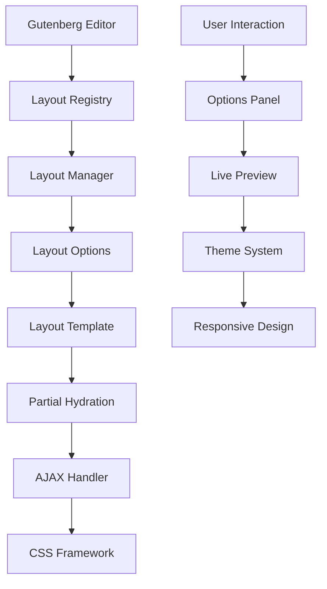

# Jankx Gutenberg Layout System

## Overview

Jankx Gutenberg Layout System là một hệ thống toàn diện cho việc tạo và quản lý layouts trong WordPress Gutenberg editor. Hệ thống này cung cấp khả năng tạo layouts tùy chỉnh, partial hydration, và một design system hoàn chỉnh.

## Architecture

### Core Components

1. **Layout Registry** - Central registry cho tất cả layouts
2. **Layout Manager** - Quản lý registration và rendering
3. **Layout Options** - System cho customizable options
4. **Layout Template** - Template system cho rendering
5. **Partial Hydration** - Lazy loading và AJAX loading
6. **AJAX Handler** - Server-side processing
7. **CSS Framework** - Complete styling system

### System Flow



## Layout Registry

### Purpose
Layout Registry serves as the central registry for all Jankx Gutenberg layouts and their configurations. It manages the definition and retrieval of layout structures and their associated blocks.

### Key Features

```php
// Register a layout
LayoutRegistry::registerLayout('hero-section', [
    'name' => 'Hero Section',
    'description' => 'A prominent hero section with title, description, and call-to-action',
    'category' => 'jankx-sections',
    'icon' => 'hero',
    'supports' => [
        'align' => true,
        'spacing' => true,
        'background' => true
    ],
    'attributes' => [
        'title' => ['type' => 'string', 'default' => ''],
        'description' => ['type' => 'string', 'default' => ''],
        'buttonText' => ['type' => 'string', 'default' => ''],
        'buttonUrl' => ['type' => 'string', 'default' => '#'],
        'alignment' => ['type' => 'string', 'default' => 'center'],
        'spacing' => ['type' => 'string', 'default' => 'normal'],
        'backgroundImage' => ['type' => 'string', 'default' => ''],
        'overlay' => ['type' => 'boolean', 'default' => false]
    ]
]);
```

### Layout Categories

- **jankx-sections** - Full-width sections (Hero, Features, etc.)
- **jankx-components** - Reusable components (Testimonials, Cards, etc.)
- **jankx-layouts** - Layout containers and grids

## Layout Manager

### Purpose
Manages the registration and initialization of layouts within the Gutenberg editor, handling different loading contexts (dashboard vs. frontend).

### Key Features

```php
class LayoutManager {
    // Register layouts as Gutenberg blocks
    public function registerLayouts();

    // Handle different loading contexts
    public function registerContextualLayouts();

    // Render layouts with partial hydration
    public function renderLayout($layoutName, $attributes, $content);

    // Server-side rendering
    protected function renderServerLayout($layoutName, $attributes, $content);

    // Client-side rendering (lazy loading)
    protected function renderClientLayout($layoutName, $attributes, $content);
}
```

### Loading Contexts

#### Dashboard Context
- Loads all available layouts
- Full feature set
- Real-time preview
- Advanced options

#### Frontend Context
- Loads only used layouts
- Optimized for performance
- Partial hydration
- Minimal options

## Layout Options System

### Purpose
Manages layout options and their configurations, providing a flexible system for customizing layouts.

### Option Groups

```php
// Default option groups
[
    'layout' => 'Layout Settings',
    'spacing' => 'Spacing & Padding',
    'background' => 'Background & Colors',
    'typography' => 'Typography',
    'animation' => 'Animation & Effects',
    'performance' => 'Performance'
]
```

### Option Types

#### Basic Types
- **text** - Text input
- **textarea** - Multi-line text
- **select** - Dropdown selection
- **toggle** - Boolean switch
- **range** - Numeric slider
- **color** - Color picker
- **media** - Media upload

#### Advanced Types
- **alignment** - Text alignment
- **spacing** - Margin/padding
- **background** - Background settings
- **typography** - Font settings
- **animation** - Animation effects
- **performance** - Loading options

### Option Registration

```php
// Register an option
Options::register('alignment', [
    'type' => 'select',
    'label' => 'Alignment',
    'description' => 'Choose text alignment',
    'group' => 'layout',
    'default' => 'center',
    'options' => [
        'left' => 'Left',
        'center' => 'Center',
        'right' => 'Right'
    ],
    'validate' => function($value) {
        return in_array($value, ['left', 'center', 'right']);
    }
]);
```

## Layout Template System

### Purpose
Manages layout template rendering and customization, providing a flexible system for creating and rendering layout templates.

### Template Structure

```php
// Register a template
Template::register('hero-section', [
    'name' => 'Hero Section',
    'description' => 'A prominent hero section with title, description, and call-to-action',
    'template' => 'hero-section.html',
    'variables' => [
        'title' => '',
        'description' => '',
        'buttonText' => 'Learn More',
        'buttonUrl' => '#',
        'backgroundImage' => '',
        'overlay' => false
    ],
    'blocks' => [
        'hero-title' => [
            'required' => true,
            'order' => 1,
            'template' => 'blocks/hero-title.html'
        ],
        'hero-description' => [
            'required' => false,
            'order' => 2,
            'template' => 'blocks/hero-description.html'
        ],
        'hero-button' => [
            'required' => false,
            'order' => 3,
            'template' => 'blocks/hero-button.html'
        ]
    ]
]);
```

### Template Rendering

```php
// Render a layout template
$html = Template::render('hero-section', $attributes, $content);

// Render individual blocks
$blockHtml = Template::renderBlock('hero-title', $blockConfig, $variables);

// Get template variables
$variables = Template::getVariables('hero-section', $attributes);
```

## Partial Hydration System

### Purpose
Provides lazy loading and AJAX loading capabilities for Gutenberg layouts, improving performance by loading layouts only when they become visible.

### Key Features

#### JavaScript Components
- **PartialHydrationManager** - Main JavaScript class for managing lazy loading
- **PerformanceMonitor** - Tracks loading performance and metrics
- **Intersection Observer** - Modern API for viewport detection
- **Fallback Support** - Scroll-based detection for older browsers

#### PHP Components
- **AjaxHandler** - PHP class for handling AJAX requests
- **Layout Caching** - Cache layout rendering for performance
- **Error Handling** - Retry mechanism and error states
- **Performance Monitoring** - Track load times and success rates

### Loading Process

1. **Detection** - Intersection Observer detects when layout enters viewport
2. **Request** - AJAX request sent to server with layout data
3. **Processing** - Server renders layout with template system
4. **Response** - HTML, CSS, and JavaScript returned
5. **Injection** - Content injected into page with animations
6. **Cleanup** - Loading states removed, observer disconnected

### Configuration

```javascript
const CONFIG = {
    // Selectors
    selectors: {
        lazyLayout: '.jankx-layout-lazy',
        loadingPlaceholder: '.jankx-layout-placeholder',
        partialHydration: '.jankx-partial-hydration',
        loadingSpinner: '.jankx-loading-spinner',
        errorContainer: '.jankx-error-container'
    },

    // Classes
    classes: {
        loaded: 'jankx-layout-loaded',
        loading: 'jankx-layout-loading',
        error: 'jankx-layout-error',
        hidden: 'jankx-layout-hidden'
    },

    // Intersection Observer
    observer: {
        root: null,
        rootMargin: '50px',
        threshold: 0.1
    },

    // AJAX
    ajax: {
        timeout: 10000,
        retryAttempts: 3,
        retryDelay: 1000
    }
};
```

## AJAX Handler

### Purpose
Handles AJAX requests for partial hydration and layout loading.

### Endpoints

- **`jankx_load_layout`** - Load layout content
- **`jankx_get_layout_options`** - Get layout options
- **`jankx_validate_layout`** - Validate layout settings
- **`jankx_get_layout_stats`** - Get performance statistics

### Response Format

```php
$response = [
    'html' => $html,
    'styles' => $styles,
    'scripts' => $scripts,
    'variables' => $variables,
    'layout' => $layoutName,
    'timestamp' => current_time('timestamp')
];
```

## CSS Framework

### Core CSS Files

1. **`layout-options.css`** - Main styles for layout options controls
2. **`layout-preview.css`** - Preview and live preview functionality
3. **`layout-themes.css`** - Theme variations and design system
4. **`partial-hydration.css`** - Loading states and skeleton screens

### Theme System

#### CSS Variables
```css
:root {
    /* Color Palette */
    --jankx-primary: #007cba;
    --jankx-primary-dark: #005a87;
    --jankx-primary-light: #00a0d2;

    /* Typography */
    --jankx-font-family: -apple-system, BlinkMacSystemFont, 'Segoe UI', Roboto, Oxygen-Sans, Ubuntu, Cantarell, 'Helvetica Neue', sans-serif;
    --jankx-font-size-base: 16px;
    --jankx-font-size-sm: 14px;
    --jankx-font-size-lg: 18px;
    --jankx-font-size-xl: 24px;
    --jankx-font-size-2xl: 32px;
    --jankx-font-size-3xl: 48px;

    /* Spacing */
    --jankx-spacing-xs: 4px;
    --jankx-spacing-sm: 8px;
    --jankx-spacing-md: 16px;
    --jankx-spacing-lg: 24px;
    --jankx-spacing-xl: 32px;
    --jankx-spacing-2xl: 48px;
    --jankx-spacing-3xl: 64px;

    /* Border Radius */
    --jankx-border-radius-sm: 4px;
    --jankx-border-radius-md: 8px;
    --jankx-border-radius-lg: 12px;
    --jankx-border-radius-xl: 16px;

    /* Shadows */
    --jankx-shadow-sm: 0 1px 2px rgba(0, 0, 0, 0.05);
    --jankx-shadow-md: 0 4px 6px rgba(0, 0, 0, 0.1);
    --jankx-shadow-lg: 0 10px 15px rgba(0, 0, 0, 0.1);
    --jankx-shadow-xl: 0 20px 25px rgba(0, 0, 0, 0.15);

    /* Transitions */
    --jankx-transition-fast: 0.15s ease;
    --jankx-transition-normal: 0.3s ease;
    --jankx-transition-slow: 0.5s ease;
}
```

#### Theme Variations
```css
/* Modern Theme */
.jankx-theme-modern {
    --jankx-primary: #6366f1;
    --jankx-primary-dark: #4f46e5;
    --jankx-primary-light: #818cf8;
    --jankx-border-radius-md: 12px;
    --jankx-shadow-md: 0 10px 15px rgba(99, 102, 241, 0.1);
}

/* Classic Theme */
.jankx-theme-classic {
    --jankx-primary: #1e40af;
    --jankx-primary-dark: #1e3a8a;
    --jankx-primary-light: #3b82f6;
    --jankx-border-radius-md: 4px;
    --jankx-shadow-md: 0 4px 6px rgba(0, 0, 0, 0.1);
}

/* Minimal Theme */
.jankx-theme-minimal {
    --jankx-primary: #000000;
    --jankx-primary-dark: #000000;
    --jankx-primary-light: #666666;
    --jankx-border-radius-md: 0px;
    --jankx-shadow-md: none;
}

/* Playful Theme */
.jankx-theme-playful {
    --jankx-primary: #f59e0b;
    --jankx-primary-dark: #d97706;
    --jankx-primary-light: #fbbf24;
    --jankx-border-radius-md: 20px;
    --jankx-shadow-md: 0 10px 25px rgba(245, 158, 11, 0.2);
}
```

### Component Styles

#### Buttons
```css
.jankx-btn {
    display: inline-flex;
    align-items: center;
    justify-content: center;
    padding: var(--jankx-spacing-sm) var(--jankx-spacing-lg);
    border: none;
    border-radius: var(--jankx-border-radius-md);
    font-size: var(--jankx-font-size-sm);
    font-weight: 600;
    text-decoration: none;
    cursor: pointer;
    transition: all var(--jankx-transition-normal);
    line-height: 1.5;
}

.jankx-btn-primary {
    background: var(--jankx-primary);
    color: white;
}

.jankx-btn-primary:hover {
    background: var(--jankx-primary-dark);
    transform: translateY(-1px);
    box-shadow: var(--jankx-shadow-lg);
}
```

#### Cards
```css
.jankx-card {
    background: #fff;
    border-radius: var(--jankx-border-radius-md);
    padding: var(--jankx-spacing-lg);
    box-shadow: var(--jankx-shadow-md);
    transition: all var(--jankx-transition-normal);
}

.jankx-card:hover {
    transform: translateY(-2px);
    box-shadow: var(--jankx-shadow-lg);
}
```

## Layout Components

### Hero Section
```css
.jankx-hero {
    padding: var(--jankx-spacing-3xl) 0;
    background: linear-gradient(135deg, var(--jankx-primary) 0%, var(--jankx-primary-light) 100%);
    color: white;
    position: relative;
    overflow: hidden;
}

.jankx-hero-title {
    font-size: var(--jankx-font-size-3xl);
    font-weight: 700;
    margin-bottom: var(--jankx-spacing-lg);
    line-height: 1.2;
}

.jankx-hero-description {
    font-size: var(--jankx-font-size-lg);
    margin-bottom: var(--jankx-spacing-xl);
    opacity: 0.9;
    line-height: 1.6;
}
```

### Testimonial
```css
.jankx-testimonial {
    padding: var(--jankx-spacing-xl) 0;
    background: #f9f9f9;
}

.jankx-testimonial-quote {
    font-size: var(--jankx-font-size-xl);
    font-style: italic;
    color: #1e1e1e;
    margin-bottom: var(--jankx-spacing-lg);
    line-height: 1.6;
}
```

### Feature Grid
```css
.jankx-feature-grid {
    padding: var(--jankx-spacing-3xl) 0;
}

.jankx-feature-item {
    text-align: center;
    padding: var(--jankx-spacing-lg);
}

.jankx-feature-icon {
    width: 80px;
    height: 80px;
    margin: 0 auto var(--jankx-spacing-lg);
    background: var(--jankx-primary);
    border-radius: 50%;
    display: flex;
    align-items: center;
    justify-content: center;
    color: white;
    font-size: 32px;
}
```

## Layout Variations

### Hero Section Variations
```css
.jankx-hero-variation-centered {
    text-align: center;
}

.jankx-hero-variation-left {
    text-align: left;
}

.jankx-hero-variation-right {
    text-align: right;
}

.jankx-hero-variation-split {
    display: grid;
    grid-template-columns: 1fr 1fr;
    gap: var(--jankx-spacing-xl);
    align-items: center;
}

.jankx-hero-variation-fullscreen {
    min-height: 100vh;
    display: flex;
    align-items: center;
    justify-content: center;
}
```

### Testimonial Variations
```css
.jankx-testimonial-variation-card {
    background: #fff;
    border-radius: var(--jankx-border-radius-md);
    padding: var(--jankx-spacing-lg);
    box-shadow: var(--jankx-shadow-md);
}

.jankx-testimonial-variation-quote {
    border-left: 4px solid var(--jankx-primary);
    padding-left: var(--jankx-spacing-lg);
}

.jankx-testimonial-variation-minimal {
    text-align: center;
    padding: var(--jankx-spacing-xl);
}
```

### Feature Grid Variations
```css
.jankx-feature-grid-variation-cards {
    display: grid;
    grid-template-columns: repeat(auto-fit, minmax(300px, 1fr));
    gap: var(--jankx-spacing-lg);
}

.jankx-feature-grid-variation-list {
    display: flex;
    flex-direction: column;
    gap: var(--jankx-spacing-md);
}

.jankx-feature-grid-variation-masonry {
    columns: 3;
    column-gap: var(--jankx-spacing-lg);
}

.jankx-feature-grid-variation-masonry > * {
    break-inside: avoid;
    margin-bottom: var(--jankx-spacing-lg);
}
```

## Responsive Design

### Mobile Breakpoints
```css
@media (max-width: 768px) {
    .jankx-hero-variation-split {
        grid-template-columns: 1fr;
        gap: var(--jankx-spacing-lg);
    }

    .jankx-hero-title {
        font-size: var(--jankx-font-size-2xl);
    }

    .jankx-hero-description {
        font-size: var(--jankx-font-size-base);
    }

    .jankx-hero-actions {
        flex-direction: column;
        align-items: center;
    }

    .jankx-feature-grid-variation-masonry {
        columns: 2;
    }

    .jankx-testimonial-quote {
        font-size: var(--jankx-font-size-lg);
    }
}

@media (max-width: 480px) {
    .jankx-hero {
        padding: var(--jankx-spacing-2xl) 0;
    }

    .jankx-hero-title {
        font-size: var(--jankx-font-size-xl);
    }

    .jankx-feature-grid-variation-masonry {
        columns: 1;
    }

    .jankx-testimonial-author {
        flex-direction: column;
        text-align: center;
    }
}
```

## Accessibility Features

### Screen Reader Support
```css
.jankx-sr-only {
    position: absolute;
    width: 1px;
    height: 1px;
    padding: 0;
    margin: -1px;
    overflow: hidden;
    clip: rect(0, 0, 0, 0);
    white-space: nowrap;
    border: 0;
}
```

### High Contrast Mode
```css
@media (prefers-contrast: high) {
    .jankx-layout-options {
        border-width: 2px;
    }

    .jankx-option-group {
        border-width: 2px;
    }

    .jankx-select-control,
    .jankx-text-control {
        border-width: 2px;
    }

    .jankx-toggle-slider {
        border: 2px solid #000;
    }

    .jankx-toggle-slider:before {
        border: 2px solid #000;
    }
}
```

### Reduced Motion
```css
@media (prefers-reduced-motion: reduce) {
    .jankx-layout-options-toggle svg,
    .jankx-option-group-toggle svg,
    .jankx-toggle-slider,
    .jankx-toggle-slider:before {
        transition: none;
    }

    .jankx-layout-placeholder {
        animation: none;
    }

    .jankx-loading-spinner {
        animation: none;
    }
}
```

## Dark Mode Support

```css
@media (prefers-color-scheme: dark) {
    .jankx-layout-options {
        background: #1e1e1e;
        border-color: #3c434a;
    }

    .jankx-layout-options-header {
        background: #2c3338;
        border-color: #3c434a;
    }

    .jankx-option-group {
        border-color: #3c434a;
    }

    .jankx-option-group-header {
        background: #2c3338;
        border-color: #3c434a;
    }

    .jankx-option-label {
        color: #f0f0f1;
    }

    .jankx-option-description {
        color: #a7aaad;
    }

    .jankx-select-control,
    .jankx-text-control {
        background: #2c3338;
        border-color: #3c434a;
        color: #f0f0f1;
    }

    .jankx-select-control:focus,
    .jankx-text-control:focus {
        border-color: #007cba;
    }

    .jankx-range-control {
        background: #3c434a;
    }

    .jankx-toggle-slider {
        background-color: #3c434a;
    }
}
```

## Performance Features

### Caching
```php
// Cache layout rendering
$cacheKey = 'jankx_layout_' . md5($layoutName . serialize($settings));
$cachedHtml = wp_cache_get($cacheKey);

if ($cachedHtml === false) {
    $cachedHtml = Template::render($layoutName, $settings, $content);
    wp_cache_set($cacheKey, $cachedHtml, '', 3600);
}

echo $cachedHtml;
```

### Lazy Loading
```javascript
// Lazy load with custom threshold
const observer = new IntersectionObserver((entries) => {
    entries.forEach(entry => {
        if (entry.isIntersecting) {
            loadLayout(entry.target);
        }
    });
}, {
    rootMargin: '100px',
    threshold: 0.1
});
```

### Performance Monitoring
```javascript
// Monitor loading performance
const monitor = new PerformanceMonitor(manager);

// Get metrics
const metrics = monitor.getMetrics();
console.log('Performance metrics:', metrics);

// Track custom events
document.addEventListener('jankx:layout:loaded', (event) => {
    console.log('Layout loaded:', event.detail.layout);
});
```

## Error Handling

### Retry Mechanism
```javascript
// Automatic retry on failure
const retryLoad = (element, maxAttempts = 3) => {
    let attempts = 0;

    const attemptLoad = () => {
        attempts++;

        loadLayout(element).catch(error => {
            if (attempts < maxAttempts) {
                setTimeout(attemptLoad, 1000 * attempts);
            } else {
                showError(element, error);
            }
        });
    };

    attemptLoad();
};
```

### Error States
```javascript
// Handle loading errors
const handleError = (element, message) => {
    element.classList.add('jankx-layout-error');

    const errorHtml = `
        <div class="jankx-layout-error">
            <div class="jankx-error-message">
                <p>Failed to load layout: ${message}</p>
                <button class="jankx-retry-button" data-jankx-retry>
                    Try Again
                </button>
            </div>
        </div>
    `;

    element.innerHTML = errorHtml;
};
```

## Usage Examples

### Basic Layout Registration
```php
// Register a hero section layout
LayoutRegistry::registerLayout('hero-section', [
    'name' => 'Hero Section',
    'description' => 'A prominent hero section with title, description, and call-to-action',
    'category' => 'jankx-sections',
    'icon' => 'hero',
    'supports' => [
        'align' => true,
        'spacing' => true,
        'background' => true
    ],
    'attributes' => [
        'title' => ['type' => 'string', 'default' => ''],
        'description' => ['type' => 'string', 'default' => ''],
        'buttonText' => ['type' => 'string', 'default' => ''],
        'buttonUrl' => ['type' => 'string', 'default' => '#'],
        'alignment' => ['type' => 'string', 'default' => 'center'],
        'spacing' => ['type' => 'string', 'default' => 'normal'],
        'backgroundImage' => ['type' => 'string', 'default' => ''],
        'overlay' => ['type' => 'boolean', 'default' => false]
    ]
]);
```

### Template Registration
```php
// Register a template
Template::register('hero-section', [
    'name' => 'Hero Section',
    'description' => 'A prominent hero section with title, description, and call-to-action',
    'template' => 'hero-section.html',
    'variables' => [
        'title' => '',
        'description' => '',
        'buttonText' => 'Learn More',
        'buttonUrl' => '#',
        'backgroundImage' => '',
        'overlay' => false
    ],
    'blocks' => [
        'hero-title' => [
            'required' => true,
            'order' => 1,
            'template' => 'blocks/hero-title.html'
        ],
        'hero-description' => [
            'required' => false,
            'order' => 2,
            'template' => 'blocks/hero-description.html'
        ],
        'hero-button' => [
            'required' => false,
            'order' => 3,
            'template' => 'blocks/hero-button.html'
        ]
    ]
]);
```

### Option Registration
```php
// Register layout options
Options::register('alignment', [
    'type' => 'select',
    'label' => 'Alignment',
    'description' => 'Choose text alignment',
    'group' => 'layout',
    'default' => 'center',
    'options' => [
        'left' => 'Left',
        'center' => 'Center',
        'right' => 'Right'
    ],
    'validate' => function($value) {
        return in_array($value, ['left', 'center', 'right']);
    }
]);

Options::register('spacing', [
    'type' => 'select',
    'label' => 'Spacing',
    'description' => 'Choose spacing style',
    'group' => 'spacing',
    'default' => 'normal',
    'options' => [
        'tight' => 'Tight',
        'normal' => 'Normal',
        'loose' => 'Loose'
    ]
]);

Options::register('backgroundImage', [
    'type' => 'media',
    'label' => 'Background Image',
    'description' => 'Choose background image',
    'group' => 'background',
    'default' => '',
    'mediaType' => 'image'
]);
```

### JavaScript Integration
```javascript
// Initialize when DOM is ready
document.addEventListener('DOMContentLoaded', function() {
    // Partial hydration is automatically initialized
    console.log('Jankx Partial Hydration ready');

    // Access the manager
    const manager = window.JankxPartialHydration.manager;

    // Get statistics
    const stats = manager.getStats();
    console.log('Loaded layouts:', stats.loaded);

    // Get performance metrics
    const metrics = window.JankxPartialHydration.getMetrics();
    console.log('Average load time:', metrics.averageLoadTime);
});
```

### CSS Integration
```css
/* Apply theme to layout */
.jankx-hero.jankx-theme-modern {
    /* Modern theme styles */
}

.jankx-hero.jankx-theme-classic {
    /* Classic theme styles */
}

.jankx-hero.jankx-theme-minimal {
    /* Minimal theme styles */
}

.jankx-hero.jankx-theme-playful {
    /* Playful theme styles */
}
```

## Best Practices

### 1. Performance Optimization
- Use skeleton screens for better perceived performance
- Implement proper caching strategies
- Monitor and optimize load times
- Use CDN for static assets

### 2. Error Handling
- Provide meaningful error messages
- Implement retry mechanisms
- Log errors for debugging
- Graceful degradation

### 3. Accessibility
- Support screen readers
- Respect reduced motion preferences
- Provide keyboard navigation
- Use semantic HTML

### 4. Mobile Optimization
- Optimize for mobile networks
- Use appropriate image sizes
- Implement touch-friendly interactions
- Test on various devices

### 5. Code Organization
- Use CSS custom properties for consistent theming
- Group related styles together
- Use semantic class names
- Maintain consistent spacing and typography

## Future Enhancements

1. **Service Worker Integration** - Offline support and caching
2. **Progressive Loading** - Load critical content first
3. **Predictive Loading** - Preload based on user behavior
4. **Analytics Integration** - Track loading performance
5. **A/B Testing** - Test different loading strategies
6. **CSS-in-JS Integration** - Dynamic styling based on props
7. **Theme Builder** - Visual theme customization
8. **Animation Library** - Pre-built animations
9. **Icon System** - Scalable vector icons
10. **Design Tokens** - Automated design system

## Browser Support

### Modern Browsers
- **Intersection Observer** - Native support
- **Fetch API** - Modern AJAX requests
- **CSS Grid/Flexbox** - Layout support
- **ES6+ Features** - Modern JavaScript

### Fallback Support
```javascript
// Fallback for older browsers
if (!window.IntersectionObserver) {
    // Use scroll events
    setupScrollFallback();
}

// Fallback for fetch
if (!window.fetch) {
    // Use XMLHttpRequest
    setupXHRFallback();
}
```

## Configuration Options

### WordPress Integration
```php
// Add to functions.php
add_action('wp_enqueue_scripts', function() {
    wp_enqueue_script('jankx-partial-hydration');
    wp_enqueue_style('jankx-partial-hydration');

    wp_localize_script('jankx-partial-hydration', 'jankxPartialHydration', [
        'ajaxUrl' => admin_url('admin-ajax.php'),
        'nonce' => wp_create_nonce('jankx_partial_hydration'),
        'debug' => WP_DEBUG,
        'strings' => [
            'loading' => __('Loading...', 'jankx'),
            'error' => __('Error loading layout', 'jankx'),
            'retry' => __('Try Again', 'jankx')
        ]
    ]);
});
```

### Custom Configuration
```javascript
// Override default configuration
window.jankxPartialHydrationConfig = {
    observer: {
        rootMargin: '100px',
        threshold: 0.2
    },
    ajax: {
        timeout: 15000,
        retryAttempts: 5
    },
    animation: {
        duration: 500,
        easing: 'ease-out'
    }
};
```

## Conclusion

Jankx Gutenberg Layout System cung cấp một giải pháp toàn diện cho việc tạo và quản lý layouts trong WordPress Gutenberg editor. Với các tính năng như partial hydration, theme system, và responsive design, hệ thống này đảm bảo hiệu suất cao và trải nghiệm người dùng tốt nhất.