# Hệ thống hóa phát triển Block cho Gutenberg

## Sơ đồ tổng quan về Gutenberg Block Development

```mermaid
graph TB
    %% Khởi tạo dự án
    Start([Bắt đầu phát triển Block]) --> ProjectStructure[📁 Cấu trúc dự án]

    %% Cấu trúc dự án
    ProjectStructure --> BlockFiles[📄 File cấu hình Block]
    ProjectStructure --> ThemeFiles[🎨 File Theme/Plugin]
    ProjectStructure --> AssetsFiles[🎯 File Assets]

    %% File cấu hình Block
    BlockFiles --> BlockJSON[📋 block.json]
    BlockFiles --> BlockPHP[🐘 block.php]
    BlockFiles --> BlockHTML[🌐 block.html]
    BlockFiles --> BlockJS[⚡ block.js]
    BlockFiles --> BlockCSS[🎨 block.css]

    %% File Theme/Plugin
    ThemeFiles --> FunctionsPHP[🔧 functions.php]
    ThemeFiles --> PluginPHP[🔌 plugin.php]
    ThemeFiles --> StyleCSS[🎨 style.css]

    %% File Assets
    AssetsFiles --> EditorCSS[✏️ editor.css]
    AssetsFiles --> FrontendCSS[🌍 frontend.css]
    AssetsFiles --> BlockJS[⚡ block.js]

    %% Luồng đăng ký Block
    BlockJSON --> RegisterBlock[📝 Đăng ký Block]
    BlockPHP --> RegisterBlock
    FunctionsPHP --> RegisterBlock

    RegisterBlock --> BlockRegistry[📚 Block Registry]
    BlockRegistry --> Editor[🎯 Gutenberg Editor]
    BlockRegistry --> Frontend[🌍 Frontend Render]

    %% Package Gutenberg Functions
    subgraph "📦 Gutenberg Package Functions"
        RegisterFunctions[🔧 Các hàm đăng ký]

        RegisterFunctions --> RegisterBlockType[📝 register_block_type【】]
        RegisterFunctions --> RegisterBlockStyle[🎨 register_block_style【】]
        RegisterFunctions --> RegisterBlockPattern[📋 register_block_pattern【】]
        RegisterFunctions --> RegisterBlockPatternCategory[📂 register_block_pattern_category【】]
        RegisterFunctions --> RegisterBlockBindings[🔗 register_block_bindings【】]
        RegisterFunctions --> RegisterBlockBindingsSource[📡 register_block_bindings_source【】]
        RegisterFunctions --> RegisterBlockVariation[🔄 register_block_variation【】]
        RegisterFunctions --> RegisterBlockTypeFromMetadata[📄 register_block_type_from_metadata【】]

        %% Chi tiết từng hàm
        RegisterBlockType --> BlockTypeDetails[📋 Đăng ký block type với metadata]
        RegisterBlockStyle --> BlockStyleDetails[🎨 Đăng ký style cho block]
        RegisterBlockPattern --> BlockPatternDetails[📋 Đăng ký pattern cho block]
        RegisterBlockPatternCategory --> PatternCategoryDetails[📂 Đăng ký category cho pattern]
        RegisterBlockBindings --> BlockBindingsDetails[🔗 Đăng ký binding cho block]
        RegisterBlockBindingsSource --> BindingsSourceDetails[📡 Đăng ký source cho binding]
        RegisterBlockVariation --> BlockVariationDetails[🔄 Đăng ký variation cho block]
        RegisterBlockTypeFromMetadata --> MetadataDetails[📄 Đăng ký từ metadata file]
    end

    %% Luồng xử lý Block
    Editor --> BlockProcessing[⚙️ Xử lý Block]
    Frontend --> BlockProcessing

    BlockProcessing --> BlockRender[🎨 Render Block]
    BlockProcessing --> BlockSave[💾 Lưu Block]
    BlockProcessing --> BlockEdit[✏️ Chỉnh sửa Block]

    %% Các loại Block
    subgraph "🎯 Các loại Block"
        BlockTypes[📦 Phân loại Block]

        BlockTypes --> CoreBlocks[🔧 Core Blocks]
        BlockTypes --> CustomBlocks[🎨 Custom Blocks]
        BlockTypes --> ThemeBlocks[🎨 Theme Blocks]
        BlockTypes --> PluginBlocks[🔌 Plugin Blocks]

        CoreBlocks --> CoreExamples[📝 paragraph, heading, image...]
        CustomBlocks --> CustomExamples[🎨 my-custom-block...]
        ThemeBlocks --> ThemeExamples[🎨 theme-specific blocks...]
        PluginBlocks --> PluginExamples[🔌 plugin-specific blocks...]
    end

    %% Cấu trúc file chi tiết
    subgraph "📄 Cấu trúc file chi tiết"
        FileStructure[📁 Cấu trúc thư mục]

        FileStructure --> BlockFolder[📁 my-block/]
        BlockFolder --> BlockJSONFile[📋 block.json]
        BlockFolder --> BlockPHPFile[🐘 block.php]
        BlockFolder --> BlockJSFile[⚡ block.js]
        BlockFolder --> BlockCSSFile[🎨 block.css]
        BlockFolder --> BlockHTMLFile[🌐 block.html]
        BlockFolder --> EditorCSSFile[✏️ editor.css]
        BlockFolder --> StyleCSSFile[🎨 style.css]
    end

    %% Luồng hoạt động
    subgraph "🔄 Luồng hoạt động"
        Workflow[⚙️ Quy trình phát triển]

        Workflow --> Development[💻 Phát triển]
        Development --> Testing[🧪 Kiểm thử]
        Testing --> Deployment[🚀 Triển khai]
        Deployment --> Maintenance[🔧 Bảo trì]

        Development --> DevSteps[📝 1. Tạo block.json<br/>2. Viết PHP logic<br/>3. Tạo JS component<br/>4. Viết CSS styles]
        Testing --> TestSteps[🧪 1. Test trong editor<br/>2. Test frontend<br/>3. Test responsive<br/>4. Test accessibility]
        Deployment --> DeploySteps[🚀 1. Build assets<br/>2. Package plugin/theme<br/>3. Upload to WordPress<br/>4. Activate]
        Maintenance --> MaintainSteps[🔧 1. Update code<br/>2. Fix bugs<br/>3. Add features<br/>4. Optimize performance]
    end

    %% Kết nối các thành phần
    BlockRegistry --> BlockTypes
    RegisterFunctions --> BlockProcessing
    FileStructure --> Development

    %% Style cho các node
    classDef startClass fill:#e1f5fe,stroke:#01579b,stroke-width:2px
    classDef processClass fill:#f3e5f5,stroke:#4a148c,stroke-width:2px
    classDef fileClass fill:#e8f5e8,stroke:#2e7d32,stroke-width:2px
    classDef functionClass fill:#fff3e0,stroke:#e65100,stroke-width:2px
    classDef workflowClass fill:#fce4ec,stroke:#880e4f,stroke-width:2px

    class Start startClass
    class BlockProcessing,BlockRegistry,Editor,Frontend processClass
    class BlockJSON,BlockPHP,BlockHTML,BlockJS,BlockCSS,EditorCSS,FrontendCSS fileClass
    class RegisterBlockType,RegisterBlockStyle,RegisterBlockPattern,RegisterBlockPatternCategory,RegisterBlockBindings,RegisterBlockBindingsSource,RegisterBlockVariation,RegisterBlockTypeFromMetadata functionClass
    class Workflow,Development,Testing,Deployment,Maintenance workflowClass
```



## Chi tiết các hàm Gutenberg Package

### 1. 📝 register_block_type【】
- **Mục đích**: Đăng ký một block type mới
- **Tham số**:
  - `$block_type`: Tên block hoặc đường dẫn đến file block.json
  - `$args`: Mảng các thuộc tính của block
- **Ví dụ**:
```php
register_block_type('my-plugin/my-block', array(
    'editor_script' => 'my-block-editor',
    'editor_style' => 'my-block-editor-style',
    'style' => 'my-block-style'
));
```

### 2. 🎨 register_block_style【】
- **Mục đích**: Đăng ký style cho block
- **Tham số**:
  - `$block_name`: Tên block
  - `$style_properties`: Thuộc tính style
- **Ví dụ**:
```php
register_block_style('core/list', array(
    'name' => 'checkmark-list',
    'label' => __('Checkmark', 'theme'),
    'inline_style' => 'ul.is-style-checkmark-list { list-style-type: "\2713"; }'
));
```

### 3. 📋 register_block_pattern【】
- **Mục đích**: Đăng ký pattern cho block
- **Tham số**:
  - `$pattern_name`: Tên pattern
  - `$pattern_properties`: Thuộc tính pattern
- **Ví dụ**:
```php
register_block_pattern('my-plugin/my-pattern', array(
    'title' => __('My Pattern', 'my-plugin'),
    'content' => '<!-- wp:paragraph --><p>Pattern content</p><!-- /wp:paragraph -->'
));
```

### 4. 📂 register_block_pattern_category【】
- **Mục đích**: Đăng ký category cho pattern
- **Tham số**:
  - `$category_name`: Tên category
  - `$category_properties`: Thuộc tính category
- **Ví dụ**:
```php
register_block_pattern_category('my-category', array(
    'label' => __('My Category', 'my-plugin'),
    'description' => __('Description for my category', 'my-plugin')
));
```

### 5. 🔗 register_block_bindings【】
- **Mục đích**: Đăng ký binding cho block (deprecated, sử dụng register_block_bindings_source)
- **Tham số**:
  - `$block_name`: Tên block
  - `$binding_properties`: Thuộc tính binding

### 6. 📡 register_block_bindings_source【】
- **Mục đích**: Đăng ký source cho block binding
- **Tham số**:
  - `$source_name`: Tên source
  - `$source_properties`: Thuộc tính source
- **Ví dụ**:
```php
register_block_bindings_source('my-plugin/my-source', array(
    'label' => __('My Source', 'my-plugin'),
    'get_value_callback' => 'my_source_callback'
));
```

### 7. 🔄 register_block_variation【】
- **Mục đích**: Đăng ký variation cho block
- **Tham số**:
  - `$block_name`: Tên block
  - `$variation_properties`: Thuộc tính variation
- **Ví dụ**:
```php
register_block_variation('core/group', array(
    'name' => 'my-variation',
    'title' => __('My Variation', 'my-plugin'),
    'attributes' => array('className' => 'my-variation-class')
));
```

### 8. 📄 register_block_type_from_metadata【】
- **Mục đích**: Đăng ký block type từ metadata file
- **Tham số**:
  - `$metadata_file`: Đường dẫn đến file metadata
  - `$args`: Tham số bổ sung
- **Ví dụ**:
```php
register_block_type_from_metadata(__DIR__ . '/blocks/my-block', array(
    'render_callback' => 'my_block_render_callback'
));
```

## Cấu trúc file block.json

```json
{
    "$schema": "https://schemas.wp.org/trunk/block.json",
    "apiVersion": 3,
    "name": "my-plugin/my-block",
    "title": "My Block",
    "category": "widgets",
    "icon": "smiley",
    "description": "A custom block example",
    "supports": {
        "html": false,
        "align": true
    },
    "attributes": {
        "content": {
            "type": "string",
            "source": "html",
            "selector": "p"
        }
    },
    "textdomain": "my-plugin",
    "editorScript": "file:./index.js",
    "editorStyle": "file:./index.css",
    "style": "file:./style-index.css"
}
```

## Luồng phát triển chi tiết

### 1. 💻 Giai đoạn phát triển
1. **Tạo cấu trúc thư mục**
2. **Viết block.json**
3. **Tạo PHP logic**
4. **Viết JavaScript component**
5. **Tạo CSS styles**

### 2. 🧪 Giai đoạn kiểm thử
1. **Test trong Gutenberg editor**
2. **Test frontend rendering**
3. **Test responsive design**
4. **Test accessibility**

### 3. 🚀 Giai đoạn triển khai
1. **Build assets**
2. **Package plugin/theme**
3. **Upload to WordPress**
4. **Activate và test**

### 4. 🔧 Giai đoạn bảo trì
1. **Update code theo WordPress updates**
2. **Fix bugs**
3. **Add new features**
4. **Optimize performance**

## Lưu ý quan trọng

- **Namespace**: Luôn sử dụng namespace cho tên block (ví dụ: `my-plugin/my-block`)
- **Hooks**: Sử dụng hook `init` để đăng ký blocks
- **Dependencies**: Quản lý dependencies trong block.json
- **Internationalization**: Sử dụng `__()` và `_e()` cho text
- **Security**: Validate và sanitize data
- **Performance**: Optimize assets và lazy load khi cần