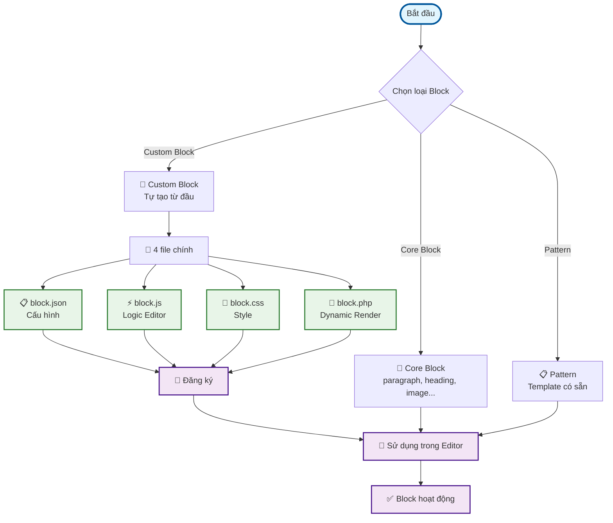
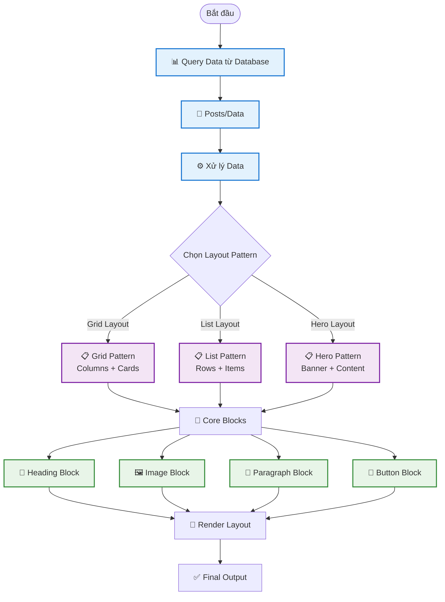

# Kiến trúc Gutenberg - Phiên bản đơn giản

## 🎯 Sơ đồ đơn giản về Gutenberg Block Development



## 🚀 Quy trình đơn giản 4 bước (với Dynamic Render)

### Bước 1: Tạo file cấu hình
```json
// block.json
{
    "name": "my-plugin/my-block",
    "title": "My Dynamic Block",
    "category": "widgets",
    "editorScript": "file:./index.js",
    "style": "file:./style.css",
    "render": "file:./render.php"
}
```

### Bước 2: Viết logic JavaScript (Editor)
```javascript
// index.js
import { registerBlockType } from '@wordpress/blocks';

registerBlockType('my-plugin/my-block', {
    edit: function(props) {
        return <div>Editor View - Chỉ hiển thị trong editor</div>;
    },
    // KHÔNG có save function vì dùng PHP render
});
```

### Bước 3: Viết PHP cho Dynamic Render
```php
// render.php
<?php
/**
 * Dynamic render callback cho block
 */
function my_dynamic_block_render($attributes, $content) {
    // Query loop example
    $args = array(
        'post_type' => 'post',
        'posts_per_page' => 5,
        'orderby' => 'date',
        'order' => 'DESC'
    );

    $query = new WP_Query($args);

    if ($query->have_posts()) {
        $output = '<div class="my-dynamic-block">';
        $output .= '<h3>' . esc_html($attributes['title'] ?? 'Latest Posts') . '</h3>';
        $output .= '<div class="posts-grid">';

        while ($query->have_posts()) {
            $query->the_post();
            $output .= '<article class="post-item">';
            $output .= '<h4><a href="' . get_permalink() . '">' . get_the_title() . '</a></h4>';
            $output .= '<p>' . get_the_excerpt() . '</p>';
            $output .= '</article>';
        }

        $output .= '</div></div>';
        wp_reset_postdata();
        return $output;
    }

    return '<p>No posts found.</p>';
}
```

### Bước 4: Đăng ký trong PHP
```php
// functions.php
add_action('init', function() {
    register_block_type(__DIR__ . '/blocks/my-block', array(
        'render_callback' => 'my_dynamic_block_render'
    ));
});
```

## 📦 Các hàm cơ bản (bao gồm Dynamic Render)

### 1. 📝 register_block_type【】
- **Dùng để**: Đăng ký block mới
- **Khi nào**: Tạo custom block
- **Dynamic**: Thêm `render_callback` parameter

### 2. 🎨 register_block_style【】
- **Dùng để**: Thêm style cho block có sẵn
- **Khi nào**: Muốn tùy chỉnh style core block

### 3. 📋 register_block_pattern【】
- **Dùng để**: Tạo template có thể tái sử dụng
- **Khi nào**: Muốn tạo layout phức tạp

## 🎯 4 loại file chính (với Dynamic Render)

| File | Mục đích | Bắt buộc | Dynamic |
|------|----------|----------|---------|
| `block.json` | Cấu hình block | ✅ | ✅ |
| `index.js` | Logic Editor | ✅ | ✅ |
| `style.css` | CSS styles | ❌ | ❌ |
| `render.php` | Dynamic Render | ❌ | ✅ |

## 🔄 Luồng hoạt động đơn giản (Dynamic)

```
1. Tạo file → 2. Viết JS (Editor) → 3. Viết PHP (Frontend) → 4. Đăng ký → 5. Sử dụng
```

## 💡 Mẹo cho Dynamic Query Loop

### **Static vs Dynamic:**
- **Static**: Chỉ hiển thị content cố định
- **Dynamic**: Hiển thị content từ database (posts, users, etc.)

### **Khi nào cần Dynamic:**
- Hiển thị danh sách posts
- Query theo category/tag
- Hiển thị user data
- Real-time data từ API

### **Ví dụ Query Loop phổ biến:**
```php
// Posts theo category
$args = array(
    'post_type' => 'post',
    'category_name' => $attributes['category'],
    'posts_per_page' => $attributes['count'] ?? 5
);

// Custom post type
$args = array(
    'post_type' => 'product',
    'meta_query' => array(
        array('key' => 'price', 'value' => 100, 'compare' => '<')
    )
);

// Users query
$users = get_users(array(
    'role' => 'author',
    'number' => 10
));
```

## 🚫 Những gì KHÔNG cần nhớ ngay

- `register_block_bindings_source【】` - Chỉ dùng cho advanced features
- `register_block_variation【】` - Chỉ khi cần nhiều phiên bản
- `register_block_type_from_metadata【】` - Tự động xử lý
- `register_block_pattern_category【】` - Chỉ khi tạo nhiều patterns

## ✅ Kết luận

**Gutenberg Dynamic Block cần:**
1. **4 file**: JSON, JS, CSS, PHP
2. **2 logic**: Editor (JS) + Frontend (PHP)
3. **1 callback**: render_callback trong PHP
4. **Query loop**: WP_Query cho dynamic content

---

# 🎨 Kết hợp Dynamic Query Loop với Pattern & Core Blocks

## 🔄 Workflow mới: Dynamic + Pattern Layout



## 🎯 Cách kết hợp Dynamic Query với Pattern

### **Bước 1: Query Data**
```php
// render.php
function my_dynamic_pattern_render($attributes) {
    // Query posts
    $args = array(
        'post_type' => 'post',
        'posts_per_page' => 6,
        'orderby' => 'date'
    );

    $query = new WP_Query($args);
    $posts = array();

    if ($query->have_posts()) {
        while ($query->have_posts()) {
            $query->the_post();
            $posts[] = array(
                'title' => get_the_title(),
                'excerpt' => get_the_excerpt(),
                'image' => get_the_post_thumbnail_url(),
                'link' => get_permalink()
            );
        }
        wp_reset_postdata();
    }

    return $posts;
}
```

### **Bước 2: Tạo Pattern Layout**
```php
// Tạo layout với Core Blocks
function create_grid_layout($posts) {
    $output = '<!-- wp:group {"layout":{"type":"constrained"}} -->';
    $output .= '<div class="wp-block-group">';

    // Heading
    $output .= '<!-- wp:heading {"level":2} -->';
    $output .= '<h2 class="wp-block-heading">Latest Posts</h2>';
    $output .= '<!-- /wp:heading -->';

    // Columns Grid
    $output .= '<!-- wp:columns {"style":{"spacing":{"padding":{"top":"var:preset|spacing|50","bottom":"var:preset|spacing|50"}}}} -->';
    $output .= '<div class="wp-block-columns" style="padding-top:var(--wp--preset--spacing--50);padding-bottom:var(--wp--preset--spacing--50)">';

    foreach ($posts as $post) {
        $output .= '<!-- wp:column -->';
        $output .= '<div class="wp-block-column">';

        // Post Card
        $output .= '<!-- wp:group {"style":{"border":{"radius":"8px"},"spacing":{"padding":{"top":"20px","bottom":"20px","left":"20px","right":"20px"}}},"backgroundColor":"white","className":"post-card"} -->';
        $output .= '<div class="wp-block-group has-white-background-color has-background post-card" style="border-radius:8px;padding-top:20px;padding-right:20px;padding-bottom:20px;padding-left:20px">';

        // Image
        if ($post['image']) {
            $output .= '<!-- wp:image {"url":"' . esc_url($post['image']) . '","alt":"' . esc_attr($post['title']) . '"} -->';
            $output .= '<figure class="wp-block-image"></figure>';
            $output .= '<!-- /wp:image -->';
        }

        // Title
        $output .= '<!-- wp:heading {"level":3} -->';
        $output .= '<h3 class="wp-block-heading"><a href="' . esc_url($post['link']) . '">' . esc_html($post['title']) . '</a></h3>';
        $output .= '<!-- /wp:heading -->';

        // Excerpt
        $output .= '<!-- wp:paragraph -->';
        $output .= '<p class="wp-block-paragraph">' . esc_html($post['excerpt']) . '</p>';
        $output .= '<!-- /wp:paragraph -->';

        // Button
        $output .= '<!-- wp:buttons -->';
        $output .= '<div class="wp-block-buttons">';
        $output .= '<!-- wp:button {"style":{"border":{"radius":"4px"}}} -->';
        $output .= '<div class="wp-block-button"><a class="wp-block-button__link wp-element-button" href="' . esc_url($post['link']) . '" style="border-radius:4px">Read More</a></div>';
        $output .= '<!-- /wp:button -->';
        $output .= '</div>';
        $output .= '<!-- /wp:buttons -->';

        $output .= '</div>';
        $output .= '<!-- /wp:group -->';

        $output .= '</div>';
        $output .= '<!-- /wp:column -->';
    }

    $output .= '</div>';
    $output .= '<!-- /wp:columns -->';

    $output .= '</div>';
    $output .= '<!-- /wp:group -->';

    return $output;
}
```

### **Bước 3: Kết hợp trong Render Callback**
```php
function my_dynamic_pattern_block_render($attributes, $content) {
    // 1. Query data
    $posts = my_dynamic_pattern_render($attributes);

    // 2. Tạo layout với pattern
    $layout = create_grid_layout($posts);

    // 3. Return HTML
    return $layout;
}
```

## 🎨 Các Pattern Layout phổ biến

### **1. Grid Layout (Columns)**
```php
// 3 cột với cards
'<!-- wp:columns --><div class="wp-block-columns">';
'<!-- wp:column --><div class="wp-block-column">';
// Card content
'<!-- /wp:column -->';
```

### **2. List Layout (Rows)**
```php
// Danh sách dọc
'<!-- wp:group --><div class="wp-block-group">';
'<!-- wp:heading --><h2>Latest Posts</h2><!-- /wp:heading -->';
'<!-- wp:list --><ul class="wp-block-list">';
// List items
'<!-- /wp:list -->';
```

### **3. Hero Layout (Banner)**
```php
// Hero section với background
'<!-- wp:group {"style":{"spacing":{"padding":{"top":"60px","bottom":"60px"}}},"backgroundColor":"primary"} -->';
'<!-- wp:heading {"textAlign":"center","textColor":"white"} -->';
'<!-- /wp:group -->';
```

## 💡 Mẹo kết hợp

### **Ưu điểm:**
- ✅ **Flexible**: Dễ thay đổi layout
- ✅ **Reusable**: Pattern có thể tái sử dụng
- ✅ **Maintainable**: Core blocks được WordPress maintain
- ✅ **Responsive**: Tự động responsive

### **Best Practices:**
1. **Query data trước** → Xử lý → Tạo pattern
2. **Sử dụng Core Blocks** thay vì custom HTML
3. **Tạo pattern templates** để tái sử dụng
4. **Test responsive** trên mobile/tablet

### **Ví dụ thực tế:**
```php
// Blog grid với featured image
function create_blog_grid($posts) {
    $output = '<!-- wp:group {"layout":{"type":"constrained"}} -->';
    $output .= '<div class="wp-block-group">';

    foreach ($posts as $post) {
        $output .= '<!-- wp:group {"className":"blog-card"} -->';
        $output .= '<div class="wp-block-group blog-card">';

        // Featured image
        if ($post['image']) {
            $output .= '<!-- wp:image {"url":"' . $post['image'] . '","alt":"' . $post['title'] . '"} -->';
            $output .= '<figure class="wp-block-image"></figure>';
            $output .= '<!-- /wp:image -->';
        }

        // Title
        $output .= '<!-- wp:heading {"level":3} -->';
        $output .= '<h3 class="wp-block-heading">' . $post['title'] . '</h3>';
        $output .= '<!-- /wp:heading -->';

        // Excerpt
        $output .= '<!-- wp:paragraph -->';
        $output .= '<p class="wp-block-paragraph">' . $post['excerpt'] . '</p>';
        $output .= '<!-- /wp:paragraph -->';

        $output .= '</div>';
        $output .= '<!-- /wp:group -->';
    }

    $output .= '</div>';
    $output .= '<!-- /wp:group -->';

    return $output;
}
```

Bây giờ bạn có thể tạo dynamic query loop và kết hợp với pattern & core blocks để tạo layout đẹp! 🎨✨