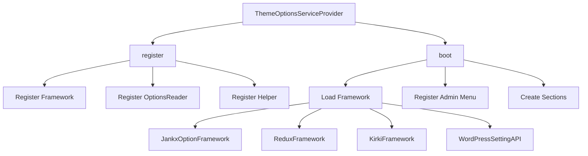
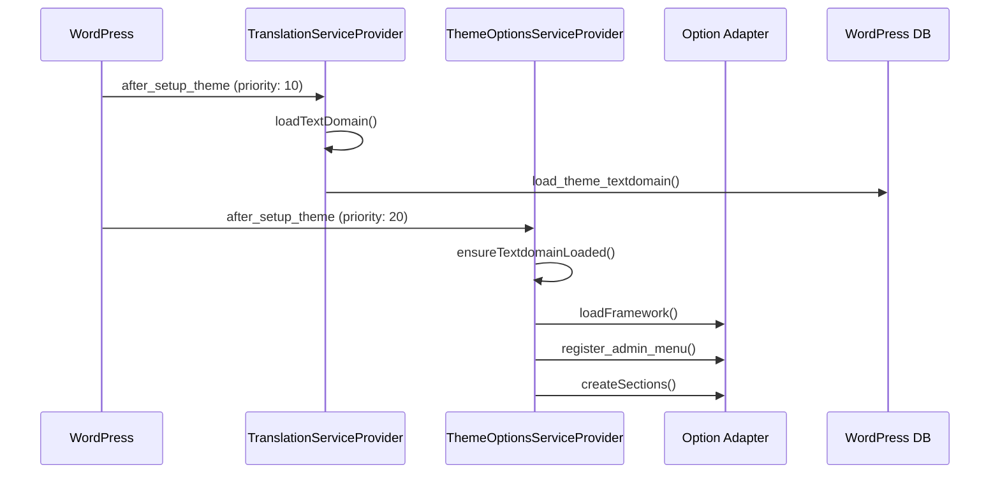
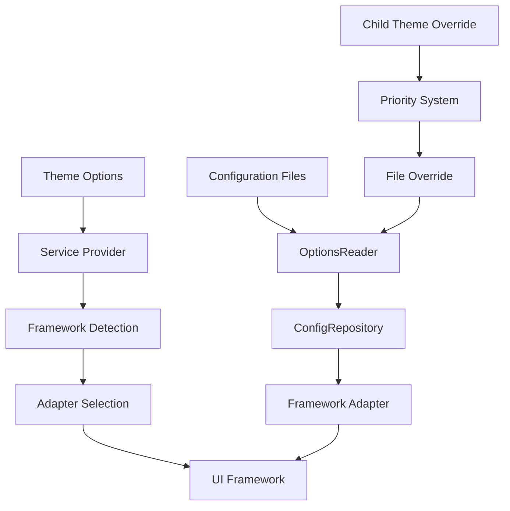

# Theme Options Documentation

Tài liệu hướng dẫn sử dụng Theme Options trong Jankx Framework với option-adapter.

## 🏗️ Architecture Overview

### **1. Service Provider Integration**



### **2. Loading Order**



### **3. Configuration Structure**



## 🚀 Rules & Requirements

### **Rule 1: Call Flow 1 Chiều**
- ✅ **Jankx Framework → option-adapter**: Chỉ có 1 chiều
- ✅ **Không có chiều ngược lại**: option-adapter không gọi lại Jankx Framework
- ✅ **Public Interface**: Chỉ expose các methods cần thiết

### **Rule 2: Menu Title Registration**
- ✅ **Adapter Interface**: Tất cả adapters phải implement `register_admin_menu()`
- ✅ **Framework Detection**: Tự động detect và load framework
- ✅ **Menu Configuration**: Set menu title, position, icon qua adapter

### **Rule 3: Modify option-adapter**
- ✅ **Flexible Architecture**: Có thể modify option-adapter
- ✅ **Extensible Design**: Dễ dàng thêm features mới
- ✅ **Backward Compatibility**: Không break existing functionality

### **Rule 4: Child Theme Override Support**
- ✅ **Directory Priority**: Child → Parent → Framework → Fallback
- ✅ **File Override**: Child theme có thể override từng file
- ✅ **Configuration Merge**: Preserve parent config nếu child không override

### **Rule 5: Standard Data Structure**
- ✅ **Format Chuẩn**: Theo cấu trúc từ `tests/configs/`
- ✅ **Field Properties**: Standard field properties
- ✅ **Security Checks**: ABSPATH check trong tất cả files

### **Rule 6: WordPress Native Field Support**
- ✅ **Direct Integration**: Fields có thể thao tác trực tiếp với WordPress
- ✅ **Action Hooks**: Support actions để chỉnh sửa WordPress data
- ✅ **Automatic Sync**: Tự động sync với WordPress options

### **Rule 7: Service Provider Integration**
- ✅ **ThemeOptionsServiceProvider**: Tạo theme options qua service provider
- ✅ **Dependency Injection**: Sử dụng Application container
- ✅ **Lifecycle Management**: Proper register/boot phases

### **Rule 8: Textdomain Loading Order**
- ✅ **After Textdomain**: Theme options load sau khi setup textdomain
- ✅ **Translation Support**: Tất cả text strings được translate
- ✅ **Hook Priority**: Proper WordPress hook priorities

## 📁 Configuration Structure

### **1. Directory Structure**

```
theme/
├── app/
│   └── Providers/
│       └── ThemeOptionsServiceProvider.php
├── config/
│   ├── app.php
│   └── providers.php
├── includes/
│   └── options/
│       ├── pages.php
│       ├── general/
│       │   ├── site_info.php
│       │   └── logo_settings.php
│       ├── colors/
│       │   ├── primary_colors.php
│       │   └── secondary_colors.php
│       └── typography/
│           ├── body_typography.php
│           └── heading_typography.php
└── child-theme/
    └── includes/
        └── options/
            ├── pages.php (Override)
            └── general/
                └── site_info.php (Override)
```

### **2. File Format Standards**

#### **A. pages.php**
```php
<?php
if (!defined('ABSPATH')) {
    exit('Cheating huh?');
}

return [
    [
        'id' => 'general',
        'name' => __('General Settings', 'jankx'),
        'args' => [
            'description' => __('General theme settings', 'jankx'),
        ],
    ],
    [
        'id' => 'colors',
        'name' => __('Color Settings', 'jankx'),
        'args' => [
            'description' => __('Theme color customization', 'jankx'),
        ],
    ],
];
```

#### **B. Section Files (general/site_info.php)**
```php
<?php
if (!defined('ABSPATH')) {
    exit('Cheating huh?');
}

return [
    'id' => 'site_info',
    'name' => __('Site Information', 'jankx'),
    'description' => __('Basic site information settings', 'jankx'),
    'fields' => [
        [
            'id' => 'site_title',
            'name' => __('Site Title', 'jankx'),
            'type' => 'text',
            'wordpress_native' => true,
            'option_name' => 'blogname',
            'default_value' => get_option('blogname'),
            'sub_title' => __('Enter your site title', 'jankx'),
            'description' => __('This will be displayed in browser tab', 'jankx'),
        ],
        [
            'id' => 'site_logo',
            'name' => __('Site Logo', 'jankx'),
            'type' => 'image',
            'default_value' => '',
            'sub_title' => __('Upload your site logo', 'jankx'),
            'description' => __('Recommended size: 200x60px', 'jankx'),
            'options' => [
                'preview_size' => 'medium',
            ],
        ],
    ],
];
```

## 🔧 Service Provider Implementation

### **1. ThemeOptionsServiceProvider**

```php
<?php

namespace App\Providers;

use Jankx\Foundation\Application;
use Jankx\Support\Providers\ServiceProvider;
use Jankx\Adapter\Options\Framework;
use Jankx\Adapter\Options\OptionsReader;

class ThemeOptionsServiceProvider extends ServiceProvider
{
    public function register(Application $app)
    {
        // Register option-adapter services
        $this->registerOptionAdapter($app);
    }

    public function boot(Application $app)
    {
        // Boot theme options after textdomain is loaded
        add_action('after_setup_theme', [$this, 'bootThemeOptions'], 20);
    }

    protected function registerOptionAdapter(Application $app)
    {
        // Register Framework singleton
        $app->singleton(Framework::class, function ($app) {
            return Framework::getInstance();
        });

        // Register OptionsReader singleton
        $app->singleton(OptionsReader::class, function ($app) {
            return OptionsReader::getInstance();
        });
    }

    public function bootThemeOptions()
    {
        // Ensure textdomain is loaded first
        $this->ensureTextdomainLoaded();

        // Load theme options
        $this->loadThemeOptions();
    }

    protected function ensureTextdomainLoaded()
    {
        if (!is_textdomain_loaded('jankx')) {
            load_theme_textdomain('jankx', get_template_directory() . '/languages');
        }
    }

    protected function loadThemeOptions()
    {
        // 1. Set framework mode
        $framework = Framework::getInstance();
        $framework->setFrameworkFromExternal('jankx');

        // 2. Load framework
        $framework->loadFramework();

        // 3. Register admin menu
        $activeFramework = $framework->getActiveFramework();
        $activeFramework->register_admin_menu(
            __('Theme Options', 'jankx'),
            __('Bookix Options', 'jankx')
        );

        // 4. Create sections
        $optionsReader = OptionsReader::getInstance();
        $activeFramework->createSections($optionsReader);
    }
}
```

### **2. Provider Registration**

#### **A. config/providers.php**
```php
return [
    'http' => [
        'admin' => [
            // TranslationServiceProvider must come first
            Jankx\Support\Providers\TranslationServiceProvider::class,

            // ThemeOptionsServiceProvider comes after
            \App\Providers\ThemeOptionsServiceProvider::class,

            // Other providers
            \App\Providers\BookAuthorServiceProvider::class,
        ],
    ],
];
```

#### **B. config/app.php**
```php
return [
    'options' => [
        'framework' => 'jankx', // jankx, redux, kirki, wordpress
        'directory' => 'includes/options',
        'menu_title' => __('Theme Options', 'jankx'),
        'display_name' => __('Bookix Options', 'jankx'),
        'menu_position' => 59,
        'menu_icon' => 'dashicons-admin-customizer',
    ],
];
```

## 🎨 Child Theme Override

### **1. Directory Priority System**

```
1. Child Theme: get_stylesheet_directory() . '/includes/options/'
2. Parent Theme: get_template_directory() . '/includes/options/'
3. Framework: JANKX_ABSPATH . '/includes/options/'
4. Fallback: option-adapter/tests/configs/
```

### **2. Override Examples**

#### **A. Override Pages (child-theme/includes/options/pages.php)**
```php
<?php
if (!defined('ABSPATH')) {
    exit('Cheating huh?');
}

return [
    [
        'id' => 'general',
        'name' => __('General Settings (Custom)', 'jankx'),
        'args' => [
            'description' => __('Customized general settings', 'jankx'),
        ],
    ],
    [
        'id' => 'custom',
        'name' => __('Custom Settings', 'jankx'),
        'args' => [
            'description' => __('Additional custom settings', 'jankx'),
        ],
    ],
];
```

#### **B. Override Sections (child-theme/includes/options/general/site_info.php)**
```php
<?php
if (!defined('ABSPATH')) {
    exit('Cheating huh?');
}

return [
    'id' => 'site_info',
    'name' => __('Site Information (Custom)', 'jankx'),
    'description' => __('Customized site information settings', 'jankx'),
    'fields' => [
        [
            'id' => 'site_title',
            'name' => __('Site Title', 'jankx'),
            'type' => 'text',
            'wordpress_native' => true,
            'option_name' => 'blogname',
            'default_value' => __('My Custom Website', 'jankx'),
        ],
        [
            'id' => 'custom_field',
            'name' => __('Custom Field', 'jankx'),
            'type' => 'text',
            'default_value' => __('Custom value', 'jankx'),
        ],
    ],
];
```

#### **C. Add New Sections (child-theme/includes/options/general/logo_settings.php)**
```php
<?php
if (!defined('ABSPATH')) {
    exit('Cheating huh?');
}

return [
    'id' => 'logo_settings',
    'name' => __('Logo Settings', 'jankx'),
    'description' => __('Custom logo settings for child theme', 'jankx'),
    'fields' => [
        [
            'id' => 'custom_logo',
            'name' => __('Custom Logo', 'jankx'),
            'type' => 'image',
            'default_value' => '',
        ],
        [
            'id' => 'logo_width',
            'name' => __('Logo Width', 'jankx'),
            'type' => 'slider',
            'default_value' => 200,
        ],
    ],
];
```

## 🔧 WordPress Native Fields

### **1. Supported Native Fields**

| Field ID | WordPress Option | Description |
|----------|------------------|-------------|
| `blogname` | `blogname` | Site Title |
| `blogdescription` | `blogdescription` | Tagline |
| `siteurl` | `siteurl` | Site URL |
| `home` | `home` | Home URL |
| `date_format` | `date_format` | Date Format |
| `time_format` | `time_format` | Time Format |
| `timezone_string` | `timezone_string` | Timezone |

### **2. Configuration Example**

```php
[
    'id' => 'site_title',
    'name' => __('Site Title', 'jankx'),
    'type' => 'text',
    'wordpress_native' => true,
    'option_name' => 'blogname',
    'default_value' => get_option('blogname'),
    'description' => __('This will update WordPress Site Title', 'jankx'),
    'actions' => [
        'save' => 'jankx/option/wordpress_native/save',
        'load' => 'jankx/option/wordpress_native/load',
    ],
]
```

### **3. Action Hooks**

```php
// Custom logic khi save WordPress native field
add_action('jankx/option/wordpress_native/save', function($field_id, $value) {
    if ($field_id === 'site_title') {
        // Custom validation
        if (empty($value)) {
            return false;
        }

        // Custom logic
        do_action('jankx/site_title_updated', $value);
    }
});

// Custom logic khi load WordPress native field
add_action('jankx/option/wordpress_native/load', function($field_id) {
    if ($field_id === 'site_title') {
        // Custom loading logic
        return apply_filters('jankx/site_title_value', get_option('blogname'));
    }
});
```

## 🎯 Field Types Support

### **1. Basic Field Types**

| Type | Description | WordPress Native |
|------|-------------|-----------------|
| `text` | Text input | ✅ |
| `textarea` | Multi-line text | ✅ |
| `image` | Image upload | ❌ |
| `icon` | Icon picker | ❌ |
| `color` | Color picker | ❌ |
| `select` | Dropdown select | ❌ |
| `radio` | Radio buttons | ❌ |
| `checkbox` | Checkbox | ❌ |
| `switch` | Toggle switch | ❌ |
| `slider` | Range slider | ❌ |
| `typography` | Typography settings | ❌ |

### **2. Field Properties**

```php
[
    'id' => 'field_id',                    // Required: Unique identifier
    'name' => 'Field Name',                // Required: Display name
    'type' => 'text',                      // Required: Field type
    'value' => '',                         // Optional: Current value
    'default_value' => 'Default',          // Optional: Default value
    'sub_title' => 'Subtitle',             // Optional: Subtitle text
    'description' => 'Description',        // Optional: Field description
    'options' => [],                       // Optional: Additional options
    'wordpress_native' => false,           // Optional: WordPress native field
    'option_name' => '',                   // Optional: WordPress option name
    'actions' => [],                       // Optional: Action hooks
]
```

## 🚀 Global Helper Functions

### **1. Available Functions**

```php
// Get option value
$value = \Jankx\Adapter\Options\Helper::getOption('primary_color', '#007cba');

// Set option value
\Jankx\Adapter\Options\Helper::setOption('primary_color', '#ff0000');

// Check option exists
if (\Jankx\Adapter\Options\Helper::hasOption('site_logo')) {
    // Do something
}

// Get options reader
$reader = \Jankx\Adapter\Options\Helper::getOptionsReader();

// Get framework
$framework = \Jankx\Adapter\Options\Helper::getFramework();
```

### **2. Usage Examples**

```php
// In template files
$site_title = \Jankx\Adapter\Options\Helper::getOption('site_title', get_bloginfo('name'));
$primary_color = \Jankx\Adapter\Options\Helper::getOption('primary_color', '#007cba');
$logo_url = \Jankx\Adapter\Options\Helper::getOption('site_logo', '');

// In functions.php
add_action('wp_head', function() {
    $custom_css = \Jankx\Adapter\Options\Helper::getOption('custom_css', '');
    if (!empty($custom_css)) {
        echo '<style>' . $custom_css . '</style>';
    }
});

// In admin
add_action('admin_init', function() {
    if (\Jankx\Adapter\Options\Helper::hasOption('enable_debug')) {
        define('WP_DEBUG', true);
    }
});
```

## 🔍 Debugging

### **1. Check Override Status**

```php
$optionsReader = \Jankx\Adapter\Options\Helper::getOptionsReader();
$directories = $optionsReader->getOptionsDirectories();

foreach ($directories as $directory) {
    echo "Directory: " . $directory . "\n";
    echo "Exists: " . (is_dir($directory) ? 'Yes' : 'No') . "\n";
}
```

### **2. Check File Priority**

```php
$optionsReader = \Jankx\Adapter\Options\Helper::getOptionsReader();
$filePath = $optionsReader->findFileInDirectories('pages.php');

if ($filePath) {
    echo "Found file: " . $filePath . "\n";
} else {
    echo "File not found in any directory\n";
}
```

### **3. Load Configuration Debug**

```php
$optionsReader = \Jankx\Adapter\Options\Helper::getOptionsReader();
$config = $optionsReader->loadConfiguration('pages.php');

if ($config) {
    echo "Configuration loaded successfully\n";
    print_r($config);
} else {
    echo "Configuration not found\n";
}
```

### **4. Framework Detection Debug**

```php
$framework = \Jankx\Adapter\Options\Helper::getFramework();
$currentMode = $framework->getCurrentMode();
$activeFramework = $framework->getActiveFramework();

echo "Current mode: " . $currentMode . "\n";
echo "Active framework: " . get_class($activeFramework) . "\n";
```

## 🚀 Best Practices

### **1. Service Provider Setup**
- ✅ TranslationServiceProvider phải load trước
- ✅ ThemeOptionsServiceProvider load sau với priority 20
- ✅ Proper dependency injection

### **2. Configuration Management**
- ✅ Tất cả text strings sử dụng `__()` function
- ✅ Textdomain 'jankx' được specify
- ✅ Security checks trong tất cả files

### **3. Child Theme Override**
- ✅ Backup parent theme configuration
- ✅ Test override trên development environment
- ✅ Document các thay đổi override

### **4. WordPress Native Fields**
- ✅ Sử dụng WordPress native fields khi có thể
- ✅ Custom action hooks cho complex logic
- ✅ Proper validation và sanitization

### **5. Performance**
- ✅ Lazy loading cho configuration
- ✅ Caching mechanisms
- ✅ Efficient file loading

### **6. Internationalization**
- ✅ Translation support cho tất cả strings
- ✅ RTL language support
- ✅ WordPress standards compliance

---

**Version**: 1.0.0
**Author**: Puleeno Nguyen
**License**: MIT