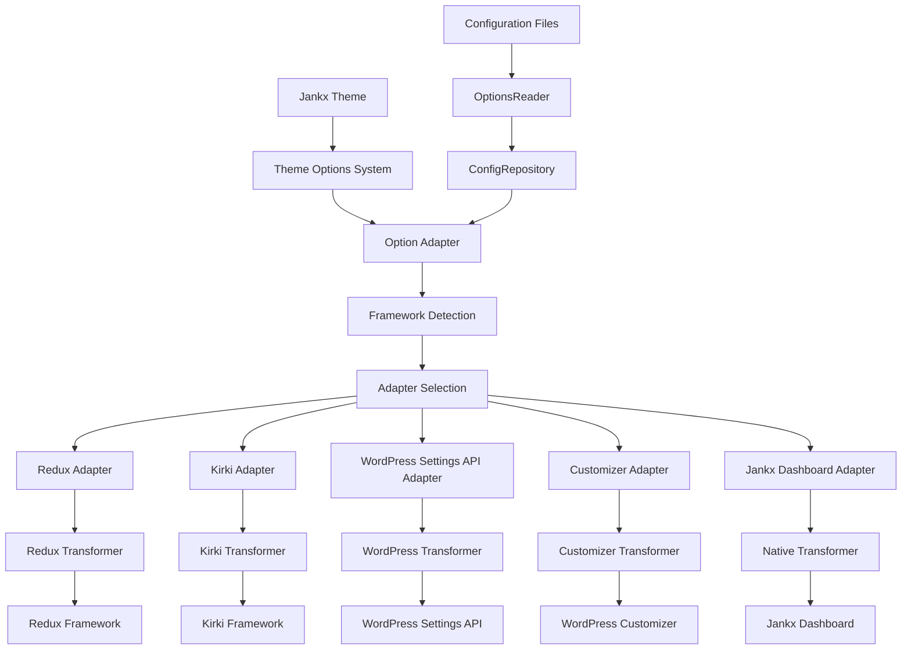

# Jankx Theme Options System

Hệ thống theme options framework-agnostic cho Jankx framework, hỗ trợ nhiều option frameworks khác nhau.

## Tổng quan

Jankx Theme Options System cung cấp một interface thống nhất để làm việc với các option frameworks khác nhau mà không cần hardcode framework-specific logic vào theme.

## Kiến trúc



## Supported Frameworks

### 1. Redux Framework
- **Adapter**: `ReduxFramework`
- **Transformer**: `ReduxTransformer`
- **Icon Mapping**: `dashicons` → `elusiveicons`
- **Features**: Advanced UI, real-time preview, import/export

### 2. Kirki Framework
- **Adapter**: `KirkiFramework`
- **Transformer**: `KirkiTransformer`
- **Icon Mapping**: `dashicons` (direct)
- **Features**: WordPress Customizer integration

### 3. WordPress Settings API
- **Adapter**: `WordPressSettingAPI`
- **Transformer**: `WordPressTransformer`
- **Icon Mapping**: `dashicons` (direct)
- **Features**: Native WordPress admin pages

### 4. WordPress Customizer
- **Adapter**: `CustomizeFramework`
- **Transformer**: `CustomizeTransformer`
- **Icon Mapping**: `dashicons` (direct)
- **Features**: Live preview, WordPress native

### 5. Jankx Dashboard (Native)
- **Adapter**: `JankxOptionFramework`
- **Transformer**: Native (không cần transformer)
- **Icon Mapping**: `dashicons` (direct)
- **Features**: React-based UI, modern interface

## Configuration

### 1. Basic Configuration

```php
// Trong config/app.php
'options' => [
    'framework' => 'redux', // hoặc 'kirki', 'wordpress', 'customize', 'jankx'
    'display_name' => 'Theme Options',
    'menu_title' => 'Theme Options',
    'page_slug' => 'theme-options',
    'dev_mode' => true,
    'import_export' => true,
],
```

### 2. Framework Detection Priority

1. **External configuration** - `setFrameworkFromExternal()`
2. **Config file** - `Config::get('app.options.framework')`
3. **WordPress options** - Database stored preference
4. **Auto detection** - Detect available frameworks

## Options Data Structure

```
resources/options/
├── pages.php                    # Pages configuration
├── general/                     # Page directory
│   ├── sections.php            # Sections cho page
│   ├── site-information/       # Section directory
│   │   └── fields.php         # Fields cho section
│   └── social-media/           # Section directory
│       └── fields.php         # Fields cho section
└── typography/                 # Page directory
    ├── sections.php
    └── body-typography/
        └── fields.php
```

### 3. Page Configuration (pages.php)

```php
return [
    'general' => [
        'title' => 'General Settings',
        'icon' => 'dashicons-admin-generic',
        'priority' => 30,
    ],
    'typography' => [
        'title' => 'Typography',
        'icon' => 'dashicons-editor-textcolor',
        'priority' => 30,
    ],
];
```

### 4. Section Configuration (sections.php)

```php
return [
    'site-information' => [
        'title' => 'Site Information',
        'description' => 'Basic site settings',
    ],
    'social-media' => [
        'title' => 'Social Media',
        'description' => 'Social media links',
    ],
];
```

### 5. Field Configuration (fields.php)

```php
return [
    'site_title' => [
        'type' => 'text',
        'title' => 'Site Title',
        'subtitle' => 'Main site title',
        'description' => 'Enter your site title',
        'default' => 'Bookix - Book Store',
    ],
    'site_logo' => [
        'type' => 'image',
        'title' => 'Site Logo',
        'subtitle' => 'Upload logo',
        'description' => 'Upload your site logo',
    ],
];
```

## Field Types Support

### Basic Fields
- `text` - Text input
- `textarea` - Textarea
- `image` - Media upload
- `icon` - Icon picker
- `color` - Color picker
- `select` - Select dropdown
- `radio` - Radio buttons
- `checkbox` - Checkbox
- `switch` - Toggle switch

### Advanced Fields
- `slider` - Range slider
- `typography` - Typography settings
- `background` - Background settings
- `spacing` - Spacing controls
- `image_select` - Image select
- `gallery` - Gallery upload
- `repeater` - Repeater field
- `sorter` - Sortable list

## Usage

### 1. Service Provider Registration

```php
// Trong config/app.php
'providers' => [
    // ... other providers
    App\Providers\ThemeOptionsServiceProvider::class,
],
```

### 2. Basic Usage

```php
use Jankx\Adapter\Options\Framework as OptionFramework;

// Initialize framework
$framework = OptionFramework::getInstance();

// Get adapter
$adapter = $framework->getAdapter();

// Create sections
$optionsReader = OptionsReader::getInstance();
$optionsReader->setOptionsDirectoryPath('resources/options');
$adapter->createSections($optionsReader);
```

### 3. Helper Functions

```php
// Get option value
$siteTitle = bookix_get_option('site_title', 'Default Title');

// Get current framework mode
$frameworkMode = bookix_get_current_framework_mode();
```

## Child Theme Support

Option Adapter tự động hỗ trợ child theme overrides:

1. **Child theme priority** - Đọc từ child theme trước
2. **Parent theme fallback** - Fallback về parent theme
3. **Deep merge** - Merge arrays một cách thông minh

## Icon Transformation

Mỗi framework có cách xử lý icons khác nhau:

### Redux Framework
```php
// dashicons → elusiveicons
'dashicons-admin-generic' => 'el el-cog'
'dashicons-editor-textcolor' => 'el el-font'
'dashicons-art' => 'el el-picture'
```

### Other Frameworks
```php
// Sử dụng dashicons trực tiếp
'dashicons-admin-generic' => 'dashicons-admin-generic'
```

## Error Handling

- **Graceful degradation** - Fallback khi framework không có sẵn
- **Debug logging** - Log chi tiết cho development
- **Exception handling** - Catch và handle exceptions

## Performance

- **Lazy loading** - Chỉ load khi cần
- **Caching** - Cache configuration và data
- **Memory efficient** - Tối ưu memory usage

## Development

### Adding New Framework

1. **Create Adapter:**
```php
class NewFrameworkAdapter implements Adapter
{
    public function createSections($optionsReader) { /* ... */ }
    public function transformIcon($dashicon) { /* ... */ }
}
```

2. **Create Transformer:**
```php
class NewFrameworkTransformer
{
    public static function transformPage($page) { /* ... */ }
    public static function transformField($field) { /* ... */ }
}
```

3. **Register in Framework:**
```php
// Trong Framework.php
protected $supportedFrameworks = [
    'newframework' => NewFrameworkAdapter::class,
];
```

### Testing

```php
// Test framework detection
$framework = OptionFramework::getInstance();
$adapter = $framework->getAdapter();
assert($adapter instanceof ExpectedAdapter);

// Test icon transformation
$icon = $adapter->transformIcon('dashicons-admin-generic');
assert($icon === 'expected-icon');
```

## Related Documentation

- [Redux Framework Options](redux-framework-options.md)
- [Option Adapter Documentation](../../vendor/jankx/option-adapter/README.md)
- [Dashboard Framework Documentation](../../vendor/jankx/dashboard-framework/README.md)

## License

MIT License - Xem file LICENSE để biết thêm chi tiết.