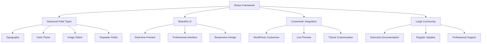
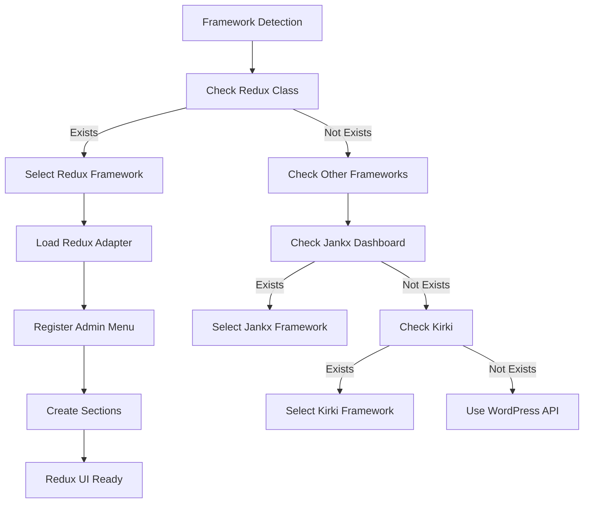
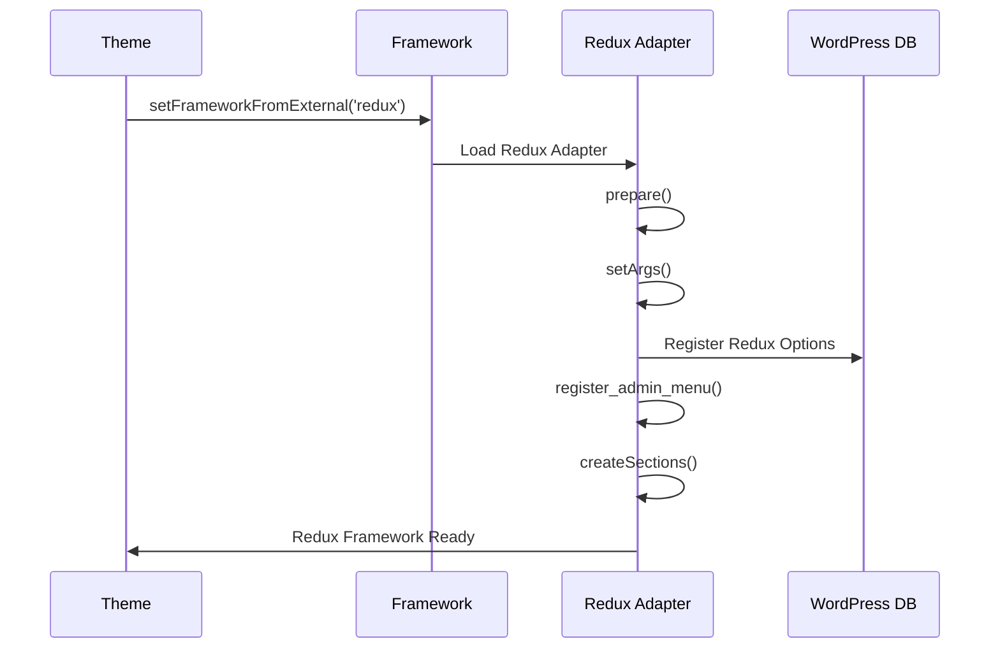

# Redux Framework Options

Tài liệu hướng dẫn sử dụng Redux Framework cho Theme Options trong Jankx Framework.

## 🏗️ Redux Framework Overview

### **1. Redux Framework Advantages**



### **2. Redux Framework Detection**



### **3. Redux Configuration Flow**



## 🚀 Redux Framework Features

### **1. Advanced Field Types**

| Field Type | Description | WordPress Native | Redux Support |
|------------|-------------|------------------|---------------|
| `text` | Text input | ✅ | ✅ |
| `textarea` | Multi-line text | ✅ | ✅ |
| `image_select` | Image select | ❌ | ✅ |
| `color` | Color picker | ❌ | ✅ |
| `typography` | Typography settings | ❌ | ✅ |
| `slider` | Range slider | ❌ | ✅ |
| `switch` | Toggle switch | ❌ | ✅ |
| `select` | Dropdown select | ❌ | ✅ |
| `radio` | Radio buttons | ❌ | ✅ |
| `checkbox` | Checkbox | ❌ | ✅ |
| `icon` | Icon picker | ❌ | ✅ |
| `media` | Media upload | ❌ | ✅ |
| `gallery` | Gallery upload | ❌ | ✅ |
| `repeater` | Repeater fields | ❌ | ✅ |
| `sorter` | Sortable fields | ❌ | ✅ |

### **2. Redux-Specific Features**

#### **A. Developer Mode**
```php
// Enable developer mode trong development
'dev_mode' => defined('WP_DEBUG') && WP_DEBUG,
```

#### **B. Customizer Integration**
```php
// Enable WordPress Customizer integration
'customizer' => true,
```

#### **C. Import/Export**
```php
// Enable import/export functionality
'import_export' => true,
```

#### **D. Real-time Preview**
```php
// Enable real-time preview
'live_preview' => true,
```

## 📁 Configuration Structure

### **1. Redux Configuration**

#### **A. config/app.php**
```php
return [
    'options' => [
        'framework' => 'redux', // Force Redux framework
        'directory' => 'includes/options',
        'menu_title' => __('Theme Options', 'jankx'),
        'display_name' => __('Bookix Options', 'jankx'),
        'menu_position' => 60,
        'menu_icon' => 'dashicons-admin-customizer',
        'dev_mode' => defined('WP_DEBUG') && WP_DEBUG,
        'customizer' => true,
        'import_export' => true,
    ],
];
```

#### **B. config/providers.php**
```php
return [
    'http' => [
        'admin' => [
            // TranslationServiceProvider must come first
            Jankx\Support\Providers\TranslationServiceProvider::class,

            // ThemeOptionsServiceProvider comes after
            \App\Providers\ThemeOptionsServiceProvider::class,

            // Other providers
            \App\Providers\BookAuthorServiceProvider::class,
        ],
    ],
];
```

### **2. Service Provider Implementation**

#### **A. ThemeOptionsServiceProvider với Redux**
```php
<?php

namespace App\Providers;

use Jankx\Foundation\Application;
use Jankx\Support\Providers\ServiceProvider;
use Jankx\Adapter\Options\Framework;
use Jankx\Adapter\Options\OptionsReader;

class ThemeOptionsServiceProvider extends ServiceProvider
{
    public function register(Application $app)
    {
        // Register option-adapter services
        $this->registerOptionAdapter($app);
    }

    public function boot(Application $app)
    {
        // Boot theme options after textdomain is loaded
        add_action('after_setup_theme', [$this, 'bootThemeOptions'], 20);
    }

    protected function registerOptionAdapter(Application $app)
    {
        // Register Framework singleton
        $app->singleton(Framework::class, function ($app) {
            return Framework::getInstance();
        });

        // Register OptionsReader singleton
        $app->singleton(OptionsReader::class, function ($app) {
            return OptionsReader::getInstance();
        });
    }

    public function bootThemeOptions()
    {
        // Ensure textdomain is loaded first
        $this->ensureTextdomainLoaded();

        // Load theme options with Redux
        $this->loadThemeOptions();
    }

    protected function ensureTextdomainLoaded()
    {
        if (!is_textdomain_loaded('jankx')) {
            load_theme_textdomain('jankx', get_template_directory() . '/languages');
        }
    }

    protected function loadThemeOptions()
    {
        // 1. Set framework mode to Redux
        $framework = Framework::getInstance();
        $framework->setFrameworkFromExternal('redux');

        // 2. Load framework
        $framework->loadFramework();

        // 3. Register admin menu with Redux
        $activeFramework = $framework->getActiveFramework();
        $activeFramework->register_admin_menu(
            __('Theme Options', 'jankx'),
            __('Bookix Options', 'jankx')
        );

        // 4. Create sections with Redux
        $optionsReader = OptionsReader::getInstance();
        $activeFramework->createSections($optionsReader);
    }
}
```

## 🎨 Field Configuration Examples

### **1. Basic Fields**

#### **A. Text Field**
```php
[
    'id' => 'site_title',
    'name' => __('Site Title', 'jankx'),
    'type' => 'text',
    'wordpress_native' => true,
    'option_name' => 'blogname',
    'default_value' => get_option('blogname'),
    'subtitle' => __('Enter your site title', 'jankx'),
    'desc' => __('This will be displayed in browser tab', 'jankx'),
]
```

#### **B. Textarea Field**
```php
[
    'id' => 'site_description',
    'name' => __('Site Description', 'jankx'),
    'type' => 'textarea',
    'wordpress_native' => true,
    'option_name' => 'blogdescription',
    'default_value' => get_option('blogdescription'),
    'subtitle' => __('Enter your site description', 'jankx'),
    'desc' => __('This will be used for SEO', 'jankx'),
]
```

### **2. Media Fields**

#### **A. Media Upload**
```php
[
    'id' => 'site_logo',
    'name' => __('Site Logo', 'jankx'),
    'type' => 'media',
    'default_value' => '',
    'subtitle' => __('Upload your site logo', 'jankx'),
    'desc' => __('Recommended size: 200x60px', 'jankx'),
    'options' => [
        'preview_size' => 'medium',
    ],
]
```

#### **B. Gallery Upload**
```php
[
    'id' => 'home_slider',
    'name' => __('Home Slider Images', 'jankx'),
    'type' => 'gallery',
    'default_value' => '',
    'subtitle' => __('Upload slider images', 'jankx'),
    'desc' => __('Select images for home page slider', 'jankx'),
]
```

### **3. Color Fields**

#### **A. Color Picker**
```php
[
    'id' => 'primary_color',
    'name' => __('Primary Color', 'jankx'),
    'type' => 'color',
    'default_value' => '#007cba',
    'subtitle' => __('Choose primary color', 'jankx'),
    'desc' => __('This will be used for buttons and links', 'jankx'),
]
```

#### **B. Color Palette**
```php
[
    'id' => 'color_palette',
    'name' => __('Color Palette', 'jankx'),
    'type' => 'color',
    'default_value' => [
        'primary' => '#007cba',
        'secondary' => '#6c757d',
        'success' => '#28a745',
        'danger' => '#dc3545',
        'warning' => '#ffc107',
        'info' => '#17a2b8',
    ],
    'subtitle' => __('Configure color palette', 'jankx'),
    'desc' => __('Set colors for different elements', 'jankx'),
]
```

### **4. Typography Fields**

#### **A. Typography Settings**
```php
[
    'id' => 'body_typography',
    'name' => __('Body Typography', 'jankx'),
    'type' => 'typography',
    'default_value' => [
        'font-family' => 'Arial, sans-serif',
        'font-size' => '16px',
        'font-weight' => '400',
        'line-height' => '1.6',
        'color' => '#333333',
    ],
    'subtitle' => __('Configure body text typography', 'jankx'),
    'desc' => __('Set font family, size, weight, and line height', 'jankx'),
]
```

#### **B. Heading Typography**
```php
[
    'id' => 'heading_typography',
    'name' => __('Heading Typography', 'jankx'),
    'type' => 'typography',
    'default_value' => [
        'font-family' => 'Georgia, serif',
        'font-size' => '24px',
        'font-weight' => '700',
        'line-height' => '1.2',
        'color' => '#000000',
    ],
    'subtitle' => __('Configure heading typography', 'jankx'),
    'desc' => __('Set typography for all headings', 'jankx'),
]
```

### **5. Layout Fields**

#### **A. Image Select**
```php
[
    'id' => 'header_layout',
    'name' => __('Header Layout', 'jankx'),
    'type' => 'image_select',
    'options' => [
        'layout-1' => [
            'alt' => 'Layout 1',
            'img' => get_template_directory_uri() . '/assets/images/layout-1.png',
        ],
        'layout-2' => [
            'alt' => 'Layout 2',
            'img' => get_template_directory_uri() . '/assets/images/layout-2.png',
        ],
        'layout-3' => [
            'alt' => 'Layout 3',
            'img' => get_template_directory_uri() . '/assets/images/layout-3.png',
        ],
    ],
    'default_value' => 'layout-1',
    'subtitle' => __('Choose header layout', 'jankx'),
    'desc' => __('Select the layout for your header', 'jankx'),
]
```

#### **B. Slider Field**
```php
[
    'id' => 'container_width',
    'name' => __('Container Width', 'jankx'),
    'type' => 'slider',
    'default_value' => 1200,
    'min' => 800,
    'max' => 1600,
    'step' => 50,
    'subtitle' => __('Set container width', 'jankx'),
    'desc' => __('Adjust the maximum width of your content', 'jankx'),
]
```

### **6. Advanced Fields**

#### **A. Repeater Fields**
```php
[
    'id' => 'social_links',
    'name' => __('Social Links', 'jankx'),
    'type' => 'repeater',
    'subtitle' => __('Add social media links', 'jankx'),
    'desc' => __('Configure your social media profiles', 'jankx'),
    'fields' => [
        [
            'id' => 'social_icon',
            'name' => __('Icon', 'jankx'),
            'type' => 'icon',
            'default_value' => 'fab fa-facebook',
        ],
        [
            'id' => 'social_url',
            'name' => __('URL', 'jankx'),
            'type' => 'text',
            'default_value' => '',
        ],
        [
            'id' => 'social_title',
            'name' => __('Title', 'jankx'),
            'type' => 'text',
            'default_value' => '',
        ],
    ],
]
```

#### **B. Sorter Fields**
```php
[
    'id' => 'home_sections',
    'name' => __('Home Page Sections', 'jankx'),
    'type' => 'sorter',
    'subtitle' => __('Arrange home page sections', 'jankx'),
    'desc' => __('Drag and drop to reorder sections', 'jankx'),
    'options' => [
        'enabled' => [
            'hero' => __('Hero Section', 'jankx'),
            'features' => __('Features Section', 'jankx'),
            'about' => __('About Section', 'jankx'),
            'services' => __('Services Section', 'jankx'),
            'testimonials' => __('Testimonials Section', 'jankx'),
            'contact' => __('Contact Section', 'jankx'),
        ],
        'disabled' => [
            'newsletter' => __('Newsletter Section', 'jankx'),
            'gallery' => __('Gallery Section', 'jankx'),
        ],
    ],
]
```

#### **C. Switch Fields**
```php
[
    'id' => 'enable_sticky_header',
    'name' => __('Enable Sticky Header', 'jankx'),
    'type' => 'switch',
    'default_value' => true,
    'subtitle' => __('Make header sticky on scroll', 'jankx'),
    'desc' => __('Header will stay at top when scrolling', 'jankx'),
],
[
    'id' => 'enable_back_to_top',
    'name' => __('Enable Back to Top', 'jankx'),
    'type' => 'switch',
    'default_value' => true,
    'subtitle' => __('Show back to top button', 'jankx'),
    'desc' => __('Display back to top button on scroll', 'jankx'),
]
```

## 🔧 Redux Configuration Files

### **1. pages.php**
```php
<?php
if (!defined('ABSPATH')) {
    exit('Cheating huh?');
}

return [
    [
        'id' => 'general',
        'name' => __('General Settings', 'jankx'),
        'args' => [
            'description' => __('General theme settings', 'jankx'),
        ],
    ],
    [
        'id' => 'header',
        'name' => __('Header Settings', 'jankx'),
        'args' => [
            'description' => __('Header customization options', 'jankx'),
        ],
    ],
    [
        'id' => 'colors',
        'name' => __('Color Settings', 'jankx'),
        'args' => [
            'description' => __('Theme color customization', 'jankx'),
        ],
    ],
    [
        'id' => 'typography',
        'name' => __('Typography Settings', 'jankx'),
        'args' => [
            'description' => __('Font and text settings', 'jankx'),
        ],
    ],
    [
        'id' => 'layout',
        'name' => __('Layout Settings', 'jankx'),
        'args' => [
            'description' => __('Page layout options', 'jankx'),
        ],
    ],
    [
        'id' => 'social',
        'name' => __('Social Settings', 'jankx'),
        'args' => [
            'description' => __('Social media configuration', 'jankx'),
        ],
    ],
];
```

### **2. general/site_info.php**
```php
<?php
if (!defined('ABSPATH')) {
    exit('Cheating huh?');
}

return [
    'id' => 'site_info',
    'name' => __('Site Information', 'jankx'),
    'description' => __('Basic site information settings', 'jankx'),
    'fields' => [
        [
            'id' => 'site_title',
            'name' => __('Site Title', 'jankx'),
            'type' => 'text',
            'wordpress_native' => true,
            'option_name' => 'blogname',
            'default_value' => get_option('blogname'),
            'subtitle' => __('Enter your site title', 'jankx'),
            'desc' => __('This will be displayed in browser tab', 'jankx'),
        ],
        [
            'id' => 'site_description',
            'name' => __('Site Description', 'jankx'),
            'type' => 'textarea',
            'wordpress_native' => true,
            'option_name' => 'blogdescription',
            'default_value' => get_option('blogdescription'),
            'subtitle' => __('Enter your site description', 'jankx'),
            'desc' => __('This will be used for SEO', 'jankx'),
        ],
        [
            'id' => 'site_logo',
            'name' => __('Site Logo', 'jankx'),
            'type' => 'media',
            'default_value' => '',
            'subtitle' => __('Upload your site logo', 'jankx'),
            'desc' => __('Recommended size: 200x60px', 'jankx'),
        ],
        [
            'id' => 'site_favicon',
            'name' => __('Site Favicon', 'jankx'),
            'type' => 'media',
            'default_value' => '',
            'subtitle' => __('Upload your site favicon', 'jankx'),
            'desc' => __('Recommended size: 32x32px', 'jankx'),
        ],
    ],
];
```

### **3. colors/primary_colors.php**
```php
<?php
if (!defined('ABSPATH')) {
    exit('Cheating huh?');
}

return [
    'id' => 'primary_colors',
    'name' => __('Primary Colors', 'jankx'),
    'description' => __('Configure primary color scheme', 'jankx'),
    'fields' => [
        [
            'id' => 'primary_color',
            'name' => __('Primary Color', 'jankx'),
            'type' => 'color',
            'default_value' => '#007cba',
            'subtitle' => __('Choose primary color', 'jankx'),
            'desc' => __('This will be used for buttons and links', 'jankx'),
        ],
        [
            'id' => 'primary_hover',
            'name' => __('Primary Hover Color', 'jankx'),
            'type' => 'color',
            'default_value' => '#005a87',
            'subtitle' => __('Choose primary hover color', 'jankx'),
            'desc' => __('This will be used for button hover states', 'jankx'),
        ],
        [
            'id' => 'secondary_color',
            'name' => __('Secondary Color', 'jankx'),
            'type' => 'color',
            'default_value' => '#6c757d',
            'subtitle' => __('Choose secondary color', 'jankx'),
            'desc' => __('This will be used for secondary elements', 'jankx'),
        ],
        [
            'id' => 'accent_color',
            'name' => __('Accent Color', 'jankx'),
            'type' => 'color',
            'default_value' => '#28a745',
            'subtitle' => __('Choose accent color', 'jankx'),
            'desc' => __('This will be used for highlights and accents', 'jankx'),
        ],
    ],
];
```

### **4. typography/body_typography.php**
```php
<?php
if (!defined('ABSPATH')) {
    exit('Cheating huh?');
}

return [
    'id' => 'body_typography',
    'name' => __('Body Typography', 'jankx'),
    'description' => __('Configure body text typography', 'jankx'),
    'fields' => [
        [
            'id' => 'body_font',
            'name' => __('Body Font', 'jankx'),
            'type' => 'typography',
            'default_value' => [
                'font-family' => 'Arial, sans-serif',
                'font-size' => '16px',
                'font-weight' => '400',
                'line-height' => '1.6',
                'color' => '#333333',
            ],
            'subtitle' => __('Configure body text typography', 'jankx'),
            'desc' => __('Set font family, size, weight, and line height', 'jankx'),
        ],
        [
            'id' => 'heading_font',
            'name' => __('Heading Font', 'jankx'),
            'type' => 'typography',
            'default_value' => [
                'font-family' => 'Georgia, serif',
                'font-size' => '24px',
                'font-weight' => '700',
                'line-height' => '1.2',
                'color' => '#000000',
            ],
            'subtitle' => __('Configure heading typography', 'jankx'),
            'desc' => __('Set typography for all headings', 'jankx'),
        ],
    ],
];
```

## 🚀 Redux Benefits

### **1. Advanced UI Features**
- ✅ **Beautiful Interface**: Professional admin interface
- ✅ **Real-time Preview**: Live preview of changes
- ✅ **Responsive Design**: Works on all devices
- ✅ **Customizer Integration**: WordPress Customizer support

### **2. Developer Experience**
- ✅ **Extensive Documentation**: Comprehensive guides
- ✅ **Large Community**: Active support community
- ✅ **Regular Updates**: Frequent feature updates
- ✅ **Professional Support**: Paid support available

### **3. Performance Features**
- ✅ **Optimized Loading**: Efficient data handling
- ✅ **Caching Mechanisms**: Built-in caching
- ✅ **Lazy Loading**: Load only what's needed
- ✅ **Memory Management**: Efficient memory usage

### **4. Advanced Field Types**
- ✅ **Typography Fields**: Complete font control
- ✅ **Color Pickers**: Advanced color selection
- ✅ **Media Fields**: Image and file management
- ✅ **Repeater Fields**: Dynamic content sections
- ✅ **Sorter Fields**: Drag and drop ordering

## 🔍 Debugging Redux

### **1. Check Redux Installation**
```php
if (class_exists('Redux')) {
    echo "Redux Framework is installed\n";
} else {
    echo "Redux Framework is not installed\n";
}
```

### **2. Check Redux Options**
```php
$redux_options = get_option('your_theme_options');
if ($redux_options) {
    echo "Redux options found\n";
    print_r($redux_options);
} else {
    echo "No Redux options found\n";
}
```

### **3. Debug Redux Framework**
```php
$framework = \Jankx\Adapter\Options\Framework::getInstance();
$currentMode = $framework->getCurrentMode();
$activeFramework = $framework->getActiveFramework();

echo "Current mode: " . $currentMode . "\n";
echo "Active framework: " . get_class($activeFramework) . "\n";

if ($currentMode === 'redux') {
    echo "Redux framework is active\n";
} else {
    echo "Redux framework is not active\n";
}
```

## 🎯 Best Practices

### **1. Redux Configuration**
- ✅ Use Redux field types for better UX
- ✅ Enable developer mode in development
- ✅ Use proper field validation
- ✅ Implement proper error handling

### **2. Performance**
- ✅ Use lazy loading for large option sets
- ✅ Implement proper caching
- ✅ Optimize field rendering
- ✅ Use efficient data structures

### **3. User Experience**
- ✅ Provide clear field descriptions
- ✅ Use appropriate field types
- ✅ Implement real-time preview
- ✅ Add helpful tooltips

### **4. Development**
- ✅ Use version control for options
- ✅ Implement backup/restore functionality
- ✅ Add import/export features
- ✅ Document custom fields

---

**Version**: 1.0.0
**Author**: Puleeno Nguyen
**License**: MIT
