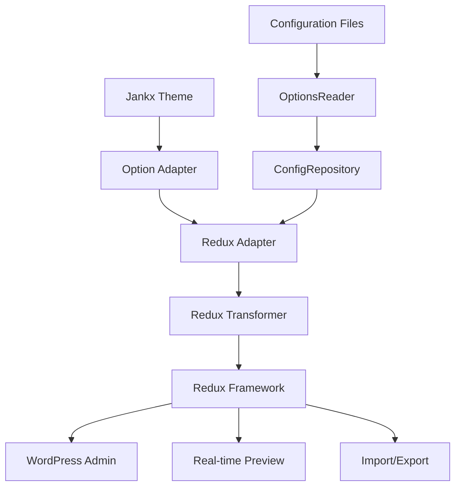

# Redux Framework Options

Hướng dẫn sử dụng Redux Framework với Jankx Theme Options System.

## Tổng quan

Redux Framework là một trong những option frameworks được hỗ trợ bởi Jankx Theme Options System. Nó cung cấp giao diện admin hiện đại với nhiều tính năng nâng cao.

## Kiến trúc



## Configuration

### 1. Enable Redux Framework

```php
// Trong config/app.php
'options' => [
    'framework' => 'redux',
    'display_name' => 'Theme Options',
    'menu_title' => 'Theme Options',
    'page_slug' => 'theme-options',
    'dev_mode' => true,
    'import_export' => true,
],
```

### 2. Redux Arguments

```php
// Redux arguments được tự động set bởi adapter
$args = [
    'opt_name' => 'bookix',
    'display_name' => 'Bookix Theme Options',
    'menu_title' => 'Theme Options',
    'customizer' => false,
    'display_version' => '1.0.0.0',
    'page_priority' => 60,
    'dev_mode' => true,
    'page_parent' => 'themes.php',
    'page_permissions' => 'manage_options',
    'save_defaults' => true,
    'default_show' => false,
    'default_mark' => '',
    'show_import_export' => true,
    'transient_time' => 3600,
    'output' => true,
    'output_tag' => true,
    'database' => '',
    'use_cdn' => true,
    'menu_type' => 'submenu',
    'allow_sub_menu' => true,
    'page_slug' => 'bookix',
];
```

## Icon Transformation

Redux Framework sử dụng Elusive Icons thay vì WordPress Dashicons:

### Icon Mapping

```php
// dashicons → elusiveicons
'dashicons-admin-generic' => 'el el-cog'
'dashicons-editor-textcolor' => 'el el-font'
'dashicons-art' => 'el el-picture'
'dashicons-layout' => 'el el-th-large'
'dashicons-align-wide' => 'el el-align-left'
'dashicons-align-full-width' => 'el el-align-justify'
'dashicons-admin-post' => 'el el-file'
'dashicons-admin-tools' => 'el el-wrench'
'dashicons-admin-settings' => 'el el-cog'
'dashicons-admin-appearance' => 'el el-picture'
'dashicons-admin-plugins' => 'el el-puzzle-piece'
'dashicons-admin-users' => 'el el-user'
'dashicons-admin-comments' => 'el el-comment'
'dashicons-admin-media' => 'el el-picture'
'dashicons-admin-links' => 'el el-link'
'dashicons-admin-page' => 'el el-file-alt'
```

### Transformation Process

1. **Original Icon**: `dashicons-admin-generic`
2. **Adapter Transform**: `ReduxFramework::transformIcon()`
3. **Final Icon**: `el el-cog`

## Field Types Mapping

### Basic Fields

| Jankx Type | Redux Type | Description |
|------------|------------|-------------|
| `text` | `text` | Text input |
| `textarea` | `textarea` | Multi-line text |
| `image` | `media` | Media upload |
| `icon` | `icon` | Icon picker |
| `color` | `color` | Color picker |
| `select` | `select` | Dropdown select |
| `radio` | `radio` | Radio buttons |
| `checkbox` | `checkbox` | Checkbox |
| `switch` | `switch` | Toggle switch |

### Advanced Fields

| Jankx Type | Redux Type | Description |
|------------|------------|-------------|
| `slider` | `slider` | Range slider |
| `typography` | `typography` | Typography settings |
| `background` | `background` | Background settings |
| `spacing` | `spacing` | Spacing controls |
| `image_select` | `image_select` | Image select |
| `gallery` | `gallery` | Gallery upload |
| `repeater` | `repeater` | Repeater field |
| `sorter` | `sorter` | Sortable list |

## Data Structure Transformation

### 1. Jankx Structure (3-level)

```
Pages
├── General Settings
│   ├── Site Information
│   │   ├── site_title (text)
│   │   ├── site_description (textarea)
│   │   └── site_logo (image)
│   └── Social Media
│       ├── facebook_url (text)
│       ├── twitter_url (text)
│       └── instagram_url (text)
└── Typography
    ├── Body Typography
    │   └── body_typography (typography)
    └── Headings Typography
        ├── h1_typography (typography)
        ├── h2_typography (typography)
        └── h3_typography (typography)
```

### 2. Redux Structure (2-level)

```
Sections
├── General Settings
│   ├── site_title (text)
│   ├── site_description (textarea)
│   ├── site_logo (media)
│   ├── facebook_url (text)
│   ├── twitter_url (text)
│   └── instagram_url (text)
└── Typography
    ├── body_typography (typography)
    ├── h1_typography (typography)
    ├── h2_typography (typography)
    └── h3_typography (typography)
```

## Field Configuration Examples

### 1. Text Field

```php
// Jankx configuration
'site_title' => [
    'type' => 'text',
    'title' => 'Site Title',
    'subtitle' => 'Main site title',
    'description' => 'Enter your site title',
    'default' => 'Bookix - Book Store',
],

// Redux transformation
[
    'id' => 'site_title',
    'type' => 'text',
    'title' => 'Site Title',
    'subtitle' => 'Main site title',
    'desc' => 'Enter your site title',
    'default' => 'Bookix - Book Store',
]
```

### 2. Select Field

```php
// Jankx configuration
'header_style' => [
    'type' => 'select',
    'title' => 'Header Style',
    'subtitle' => 'Header layout style',
    'description' => 'Choose header layout style',
    'default' => 'style1',
    'options' => [
        'style1' => 'Style 1 - Classic',
        'style2' => 'Style 2 - Modern',
        'style3' => 'Style 3 - Minimal',
        'style4' => 'Style 4 - Creative',
    ],
],

// Redux transformation
[
    'id' => 'header_style',
    'type' => 'select',
    'title' => 'Header Style',
    'subtitle' => 'Header layout style',
    'desc' => 'Choose header layout style',
    'default' => 'style1',
    'options' => [
        'style1' => 'Style 1 - Classic',
        'style2' => 'Style 2 - Modern',
        'style3' => 'Style 3 - Minimal',
        'style4' => 'Style 4 - Creative',
    ],
]
```

### 3. Slider Field

```php
// Jankx configuration
'container_width' => [
    'type' => 'slider',
    'title' => 'Container Width',
    'subtitle' => 'Container width in pixels',
    'description' => 'Set the maximum width of the main container',
    'default' => 1200,
    'min' => 800,
    'max' => 1400,
    'step' => 10,
],

// Redux transformation
[
    'id' => 'container_width',
    'type' => 'slider',
    'title' => 'Container Width',
    'subtitle' => 'Container width in pixels',
    'desc' => 'Set the maximum width of the main container',
    'default' => 1200,
    'min' => 800,
    'max' => 1400,
    'step' => 10,
]
```

### 4. Typography Field

```php
// Jankx configuration
'body_typography' => [
    'type' => 'typography',
    'title' => 'Body Typography',
    'subtitle' => 'Body text typography',
    'description' => 'Configure typography for body text',
    'default' => [
        'font-family' => 'Open Sans, sans-serif',
        'font-size' => '16px',
        'font-weight' => '400',
        'font-style' => 'normal',
        'line-height' => '1.6',
        'letter-spacing' => '0px',
        'text-align' => 'left',
        'text-transform' => 'none',
        'color' => '#333333',
    ],
],

// Redux transformation
[
    'id' => 'body_typography',
    'type' => 'typography',
    'title' => 'Body Typography',
    'subtitle' => 'Body text typography',
    'desc' => 'Configure typography for body text',
    'default' => [
        'font-family' => 'Open Sans, sans-serif',
        'font-size' => '16px',
        'font-weight' => '400',
        'font-style' => 'normal',
        'line-height' => '1.6',
        'letter-spacing' => '0px',
        'text-align' => 'left',
        'text-transform' => 'none',
        'color' => '#333333',
    ],
]
```

## Advanced Features

### 1. WordPress Native Fields

```php
// Jankx configuration
'blogname' => [
    'type' => 'text',
    'title' => 'Site Title',
    'subtitle' => 'WordPress site title',
    'description' => 'This field is connected to WordPress option',
    'wordpress_native' => true,
    'option_name' => 'blogname',
],

// Redux transformation
[
    'id' => 'blogname',
    'type' => 'text',
    'title' => 'Site Title',
    'subtitle' => 'WordPress site title',
    'desc' => 'This field is connected to WordPress option',
    'wordpress_native' => true,
    'option_name' => 'blogname',
]
```

### 2. Conditional Fields

```php
// Jankx configuration
'enable_custom_logo' => [
    'type' => 'switch',
    'title' => 'Enable Custom Logo',
    'default' => true,
],

'custom_logo' => [
    'type' => 'image',
    'title' => 'Custom Logo',
    'required' => ['enable_custom_logo', '=', true],
],

// Redux transformation
[
    'id' => 'enable_custom_logo',
    'type' => 'switch',
    'title' => 'Enable Custom Logo',
    'default' => true,
],
[
    'id' => 'custom_logo',
    'type' => 'media',
    'title' => 'Custom Logo',
    'required' => ['enable_custom_logo', '=', true],
]
```

### 3. Repeater Fields

```php
// Jankx configuration
'social_links' => [
    'type' => 'repeater',
    'title' => 'Social Links',
    'subtitle' => 'Add social media links',
    'fields' => [
        'platform' => [
            'type' => 'select',
            'title' => 'Platform',
            'options' => [
                'facebook' => 'Facebook',
                'twitter' => 'Twitter',
                'instagram' => 'Instagram',
            ],
        ],
        'url' => [
            'type' => 'text',
            'title' => 'URL',
        ],
    ],
],

// Redux transformation
[
    'id' => 'social_links',
    'type' => 'repeater',
    'title' => 'Social Links',
    'subtitle' => 'Add social media links',
    'fields' => [
        [
            'id' => 'platform',
            'type' => 'select',
            'title' => 'Platform',
            'options' => [
                'facebook' => 'Facebook',
                'twitter' => 'Twitter',
                'instagram' => 'Instagram',
            ],
        ],
        [
            'id' => 'url',
            'type' => 'text',
            'title' => 'URL',
        ],
    ],
]
```

## Performance Optimization

### 1. Lazy Loading

```php
// Redux arguments optimization
$args = [
    'output' => false, // Disable CSS output if not needed
    'output_tag' => false, // Disable output tag
    'use_cdn' => false, // Disable CDN for better performance
    'transient_time' => 0, // Disable transient caching
];
```

### 2. Conditional Loading

```php
// Only load Redux on options page
if (isset($_GET['page']) && $_GET['page'] === 'theme-options') {
    // Load Redux assets
}
```

### 3. Asset Optimization

```php
// Minified assets in production
if (!WP_DEBUG) {
    $args['use_cdn'] = true;
    $args['output'] = false;
}
```

## Error Handling

### 1. Framework Detection

```php
// Check if Redux is available
if (!class_exists('Redux')) {
    // Fallback to another framework
    $framework->setFrameworkFromExternal('wordpress');
}
```

### 2. Field Validation

```php
// Validate field configuration
if (!isset($field['id']) || !isset($field['type'])) {
    error_log('Invalid field configuration: ' . json_encode($field));
    continue;
}
```

### 3. Icon Transformation

```php
// Safe icon transformation
$icon = $adapter->transformIcon($originalIcon);
if (empty($icon)) {
    $icon = 'el el-cog'; // Fallback icon
}
```

## Debugging

### 1. Enable Debug Mode

```php
// In config/app.php
'options' => [
    'framework' => 'redux',
    'dev_mode' => true, // Enable debug mode
],
```

### 2. Check Transformation Logs

```php
// Debug logs will show transformation process
[JANKX DEBUG] ReduxTransformer: Original icon from page: "dashicons-admin-generic"
[JANKX DEBUG] ReduxFramework: Mapping icon "dashicons-admin-generic" to "el el-cog"
[JANKX DEBUG] ReduxTransformer: Icon transformed by adapter: "el el-cog"
```

### 3. Verify Field Count

```php
// Check if all fields are transformed
[JANKX DEBUG] ReduxTransformer: Final section "General Settings" has 12 fields
[JANKX DEBUG] ReduxTransformer: Transformation completed with 8 sections
```

## Best Practices

### 1. Field Organization

- Group related fields in sections
- Use descriptive field IDs
- Provide clear descriptions and subtitles
- Set appropriate default values

### 2. Icon Selection

- Use semantic dashicons
- Ensure icon transformation works correctly
- Test icon display in Redux interface

### 3. Performance

- Minimize field count per section
- Use appropriate field types
- Optimize Redux arguments for production

### 4. User Experience

- Provide clear field descriptions
- Use logical field ordering
- Include helpful subtitles
- Set sensible default values

## Troubleshooting

### 1. Icons Not Displaying

**Problem**: Icons show as `dashicons` instead of `elusiveicons`

**Solution**: Check icon transformation in `ReduxFramework::transformIcon()`

### 2. Fields Not Appearing

**Problem**: Sections are empty in Redux interface

**Solution**: Verify field transformation in `ReduxTransformer::transformField()`

### 3. Menu Not Showing

**Problem**: Theme options menu doesn't appear

**Solution**: Check Redux initialization and admin menu registration

### 4. Performance Issues

**Problem**: Slow loading or high memory usage

**Solution**: Optimize Redux arguments and disable unnecessary features

## Related Documentation

- [Theme Options Overview](../readme.md)
- [Option Adapter Documentation](../../../vendor/jankx/option-adapter/README.md)
- [Redux Framework Documentation](https://reduxframework.com/)

## License

MIT License - Xem file LICENSE để biết thêm chi tiết.
